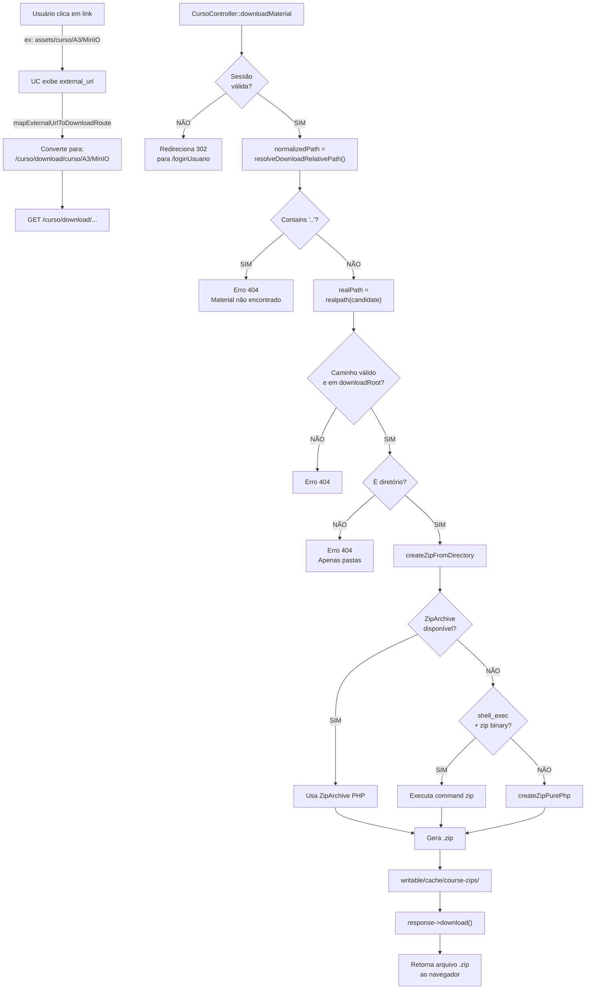

# Implementação de Download Seguro de Materiais de Curso

**Data:** 17 de Março de 2026  
**Versão:** 1.0  
**Status:** Implementado e Testado ✅

---

## 1. Objetivo

Implementar um sistema seguro de download de materiais de curso (pastas zípadas) através da rota `/curso/download/...` usando o diretório `writable` do CodeIgniter, substituindo o acesso direto inseguro em `assets/curso/...` que retornava `Forbidden 403`.

---

## 2. Requisitos Cumpridos

✅ Download de pastas como arquivo `.zip`  
✅ Validação de sessão de usuário logado  
✅ Proteção contra path traversal (`../`)  
✅ Suporte multiplataforma (ZipArchive → system zip → pure PHP)  
✅ Cache de zips temporários com TTL  
✅ Limpeza automática de zips antigos  
✅ Conversão automática de links `assets/curso/...` em UCs  

---

## 3. Estrutura de Diretórios

```
src/codeigniter-app/
├── app/
│   ├── Config/
│   │   └── Routes.php                    (MODIFICADO - linha 4)
│   └── Controllers/
│       └── CursoController.php           (MODIFICADO - métodos novos)
├── writable/
│   ├── cache/
│   │   └── course-zips/                  (CRIADO - zip temporários)
│   ├── downloads/
│   │   └── curso/                        (CRIADO - materiais migrados)
│   │       ├── A2/
│   │       │   ├── DQ Custom Validators.pptx
│   │       │   ├── Invoice.json
│   │       │   └── meu_validador.py
│   │       └── A3/
│   │           └── MinIO/
│   │               ├── docker-compose.yml
│   │               └── Roteiro-MinIO.txt
│   └── logs/
│   └── session/
├── assets/
│   └── curso/                            (ORIGINAL - mantido como fallback)
│       ├── A2/
│       └── A3/
└── ...
```

---

## 4. Alterações no Código

### 4.1 Routes.php

**Localização:** `src/codeigniter-app/app/Config/Routes.php`  
**Linha adicionada:** Logo após `$routes->get('/curso/modulo1', ...)`

```php
// Curso - Download de materiais via writable (seguro)
$routes->get('/curso/download/(.*)', 'CursoController::downloadMaterial/$1', ['as'=>'curso.download-material']);
```

**Padrão da rota:**
- Aceita: `GET /curso/download/curso/A3/MinIO`
- Retorna: `MinIO.zip`
- Requer: Sessão de usuário logado

---

### 4.2 CursoController.php

**Localização:** `src/codeigniter-app/app/Controllers/CursoController.php`

#### 4.2.1 Constantes adicionadas (linha 18-20)

```php
private const COURSE_ASSETS_PREFIX = 'assets/curso/';
private const DOWNLOADS_BASE_DIR = 'downloads/';
private const TEMP_ZIP_DIR = 'cache/course-zips/';
private const TEMP_ZIP_TTL_SECONDS = 3600;  // 1 hora
```

#### 4.2.2 Método `downloadMaterial()` (linha 243-274)

```php
public function downloadMaterial(string $relativePath = '')
{
    // 1. Validação de sessão
    if (!isset($_SESSION['id_usuario_logado']) || empty($_SESSION['id_usuario_logado'])) {
        return redirect()->to('/loginUsuario');
    }

    // 2. Normalização do caminho com resolução de truncamento
    $normalizedPath = $this->resolveDownloadRelativePath($relativePath);

    // 3. Validação contra path traversal
    if ($normalizedPath === '' || str_contains($normalizedPath, '..')) {
        throw PageNotFoundException::forPageNotFound('Material não encontrado.');
    }

    // 4. Preparação do diretório base
    $downloadRoot = WRITEPATH . self::DOWNLOADS_BASE_DIR;
    if (!is_dir($downloadRoot) && !mkdir($downloadRoot, 0755, true) && !is_dir($downloadRoot)) {
        throw PageNotFoundException::forPageNotFound('Diretório de materiais indisponível.');
    }

    // 5. Resolução e validação do caminho real
    $realDownloadRoot = realpath($downloadRoot);
    $candidatePath = $downloadRoot . $normalizedPath;
    $realPath = realpath($candidatePath);

    if (
        !$realDownloadRoot
        || !$realPath
        || !str_starts_with($realPath, $realDownloadRoot)
    ) {
        throw PageNotFoundException::forPageNotFound('Material não encontrado.');
    }

    // 6. Validação de que é diretório (apenas pastas podem ser baixadas)
    if (!is_dir($realPath)) {
        throw PageNotFoundException::forPageNotFound('Apenas pastas podem ser baixadas nesta rota.');
    }

    // 7. Geração do ZIP
    $zipFilePath = $this->createZipFromDirectory($realPath, $normalizedPath, $realDownloadRoot);
    $zipFileName = basename($realPath) . '.zip';

    // 8. Download do arquivo
    return $this->response
        ->download($zipFilePath, null)
        ->setFileName($zipFileName);
}
```

#### 4.2.3 Método `mapExternalUrlToDownloadRoute()` (linha 276-304)

Converte automaticamente links `assets/curso/...` nas UCs para a nova rota segura:

```php
private function mapExternalUrlToDownloadRoute(?string $externalUrl): ?string
{
    // Retorna null/vazio se URL for nula
    if ($externalUrl === null) {
        return null;
    }

    $trimmedUrl = trim($externalUrl);
    if ($trimmedUrl === '') {
        return $trimmedUrl;
    }

    // Se for URL absoluta (http/https), retorna como está
    if (preg_match('#^https?://#i', $trimmedUrl)) {
        return $trimmedUrl;
    }

    // Extrai apenas o caminho (sem query string)
    $pathOnly = preg_split('/[?#]/', $trimmedUrl)[0] ?? $trimmedUrl;
    $normalizedPath = ltrim($pathOnly, '/');

    // Se não for `assets/curso/...`, retorna como está
    if (!str_starts_with($normalizedPath, self::COURSE_ASSETS_PREFIX)) {
        return $trimmedUrl;
    }

    // Converte: assets/curso/A3/MinIO → site_url('curso/download/curso/A3/MinIO')
    $courseRelativePath = 'curso/' . ltrim(substr($normalizedPath, strlen(self::COURSE_ASSETS_PREFIX)), '/');
    $encodedPath = implode('/', array_map('rawurlencode', explode('/', $courseRelativePath)));

    return site_url('curso/download/' . $encodedPath);
}
```

**Onde é usado:**
- No método `video()` do CursoController (linha 228-231)
- Aplica a conversão aos `external_url` das UCs antes de renderizar a view

#### 4.2.4 Métodos de Geração de ZIP

Implementação em camadas com fallback automático:

**Ordem de execução:**
1. `createZipFromDirectory()` → Orquestra a estratégia
2. Se `ZipArchive` disponível → usa `ZipArchive`
3. Senão, tenta `createZipWithSystemBinary()` (binário `zip`)
4. Senão, cai em `createZipPurePhp()` (implementação 100% PHP)

**4.2.4.1 `createZipFromDirectory()`** (linha 306-365)

```php
private function createZipFromDirectory(string $directoryPath, string $normalizedPath, string $realDownloadRoot): string
{
    // 1. Preparação do diretório temporário
    $zipDir = WRITEPATH . self::TEMP_ZIP_DIR;
    if (!is_dir($zipDir) && !mkdir($zipDir, 0755, true) && !is_dir($zipDir)) {
        throw PageNotFoundException::forPageNotFound('Não foi possível preparar o download.');
    }

    // 2. Limpeza de zips antigos (TTL)
    $this->cleanupOldZipFiles($zipDir);

    // 3. Hash determinístico (cache se pasta não mudou)
    $directoryMtime = (string) (filemtime($directoryPath) ?: time());
    $zipFilePath = $zipDir . sha1($normalizedPath . '|' . $directoryMtime) . '.zip';

    // 4. Se já existe, reutiliza
    if (is_file($zipFilePath)) {
        return $zipFilePath;
    }

    // 5. Tenta ZipArchive primeiro
    if (class_exists(\ZipArchive::class)) {
        // ... implementação ZipArchive
        return $zipFilePath;
    }

    // 6. Fallback para system binary ou pure PHP
    $this->createZipWithSystemBinary($directoryPath, $zipFilePath, $realDownloadRoot);
    return $zipFilePath;
}
```

**4.2.4.2 `createZipWithSystemBinary()`** (linha 367-406)

```php
private function createZipWithSystemBinary(string $directoryPath, string $zipFilePath, string $realDownloadRoot): void
{
    // 1. Verifica se shell_exec está disponível
    if (!function_exists('shell_exec')) {
        $this->createZipPurePhp($directoryPath, $zipFilePath, $realDownloadRoot);
        return;
    }

    // 2. Verifica se binário `zip` está instalado
    $zipBin = trim((string) shell_exec('command -v zip 2>/dev/null'));
    if ($zipBin === '') {
        $this->createZipPurePhp($directoryPath, $zipFilePath, $realDownloadRoot);
        return;
    }

    // 3. Executa command system para gerar ZIP
    $parentDir = dirname($directoryPath);
    $folderName = basename($directoryPath);
    $cmd = sprintf(
        'cd %s && %s -r -q %s %s 2>/dev/null',
        escapeshellarg($parentDir),
        escapeshellarg($zipBin),
        escapeshellarg($zipFilePath),
        escapeshellarg($folderName)
    );
    shell_exec($cmd);

    // 4. Se falhar, cai para pure PHP
    if (!is_file($zipFilePath) || filesize($zipFilePath) === 0) {
        $this->createZipPurePhp($directoryPath, $zipFilePath, $realDownloadRoot);
    }
}
```

**4.2.4.3 `createZipPurePhp()`** (linha 408-507)

Implementação completa do formato ZIP em PHP puro (RFC 1951 + ZIP64 básico):

```php
private function createZipPurePhp(string $directoryPath, string $zipFilePath, string $realDownloadRoot): void
{
    // 1. Abre arquivo ZIP para escrita
    $zipHandle = fopen($zipFilePath, 'wb');
    if ($zipHandle === false) {
        throw PageNotFoundException::forPageNotFound('Não foi possível gerar o arquivo compactado.');
    }

    // 2. Iteração sobre arquivos
    $folderName = basename($directoryPath);
    $centralDirectory = '';
    $offset = 0;
    $entryCount = 0;

    $iterator = new \RecursiveIteratorIterator(
        new \RecursiveDirectoryIterator($directoryPath, \FilesystemIterator::SKIP_DOTS),
        \RecursiveIteratorIterator::SELF_FIRST
    );

    foreach ($iterator as $item) {
        if (!$item->isFile()) {
            continue;
        }

        // 3. Validação de acesso (path traversal check)
        $realItemPath = $item->getRealPath();
        if ($realItemPath === false || !str_starts_with($realItemPath, $realDownloadRoot)) {
            continue;
        }

        // 4. Leitura do conteúdo do arquivo
        $data = file_get_contents($realItemPath);
        if ($data === false) {
            continue;
        }

        // 5. Montagem do caminho relativo dentro do ZIP
        $relativeInFolder = ltrim(str_replace($directoryPath, '', $realItemPath), DIRECTORY_SEPARATOR);
        $relativeInFolder = str_replace('\\', '/', $relativeInFolder);
        $entryName = $folderName . '/' . $relativeInFolder;

        // 6. Cálculo de timestamp DOS (compatível com ZIP)
        $dosDateTime = $this->toDosDateTime((int) $item->getMTime());
        $dosTime = $dosDateTime['time'];
        $dosDate = $dosDateTime['date'];

        // 7. Cálculo de CRC e tamanho
        $uncompressedSize = strlen($data);
        $crc = (int) sprintf('%u', crc32($data));

        // 8. Escrita do Local Header (PK\x03\x04)
        $localHeader = "PK\x03\x04"
            . pack('v', 20)          // Version
            . pack('v', 0)           // Flags
            . pack('v', 0)           // Compression (0 = stored)
            . pack('v', $dosTime)    // File modification time
            . pack('v', $dosDate)    // File modification date
            . pack('V', $crc)        // CRC-32
            . pack('V', $uncompressedSize)  // Compressed size
            . pack('V', $uncompressedSize)  // Uncompressed size
            . pack('v', strlen($entryName)) // Filename length
            . pack('v', 0)           // Extra field length
            . $entryName;

        fwrite($zipHandle, $localHeader);
        fwrite($zipHandle, $data);

        // 9. Construção do Central Directory Header
        $centralDirectory .= "PK\x01\x02"
            . pack('v', 20)          // Made by version
            . pack('v', 20)          // Extract by version
            . pack('v', 0)           // Flags
            . pack('v', 0)           // Compression
            . pack('v', $dosTime)
            . pack('v', $dosDate)
            . pack('V', $crc)
            . pack('V', $uncompressedSize)
            . pack('V', $uncompressedSize)
            . pack('v', strlen($entryName))
            . pack('v', 0)           // Extra
            . pack('v', 0)           // Comment
            . pack('v', 0)           // Disk
            . pack('v', 0)           // Internal
            . pack('V', 0)           // External
            . pack('V', $offset)     // Offset
            . $entryName;

        $offset += strlen($localHeader) + $uncompressedSize;
        $entryCount++;
    }

    // 10. Escrita do Central Directory
    $centralDirectorySize = strlen($centralDirectory);
    fwrite($zipHandle, $centralDirectory);

    // 11. Escrita do End of Central Directory (PK\x05\x06)
    fwrite(
        $zipHandle,
        "PK\x05\x06"
        . pack('v', 0)               // Disk number
        . pack('v', 0)               // Start disk
        . pack('v', $entryCount)     // Entries on this disk
        . pack('v', $entryCount)     // Total entries
        . pack('V', $centralDirectorySize)  // Central directory size
        . pack('V', $offset)         // Central directory offset
        . pack('v', 0)               // Comment length
    );

    fclose($zipHandle);

    // 12. Validação final
    if (!is_file($zipFilePath) || filesize($zipFilePath) === 0) {
        throw PageNotFoundException::forPageNotFound('Não foi possível gerar o arquivo compactado.');
    }
}
```

**4.2.4.4 `toDosDateTime()`** (linha 509-528)

Converte timestamp Unix para formato DOS (compatível com ZIP):

```php
private function toDosDateTime(int $timestamp): array
{
    $date = getdate($timestamp);

    $year = max(1980, (int) $date['year']);
    $month = (int) $date['mon'];
    $day = (int) $date['mday'];
    $hour = (int) $date['hours'];
    $minute = (int) $date['minutes'];
    $second = (int) floor($date['seconds'] / 2);

    $dosTime = ($hour << 11) | ($minute << 5) | $second;
    $dosDate = (($year - 1980) << 9) | ($month << 5) | $day;

    return [
        'time' => $dosTime,
        'date' => $dosDate,
    ];
}
```

**4.2.4.5 `cleanupOldZipFiles()`** (linha 530-545)

Remove zips temporários com mais de 1 hora (TTL):

```php
private function cleanupOldZipFiles(string $zipDir): void
{
    $zipFiles = glob(rtrim($zipDir, DIRECTORY_SEPARATOR) . DIRECTORY_SEPARATOR . '*.zip');
    if ($zipFiles === false) {
        return;
    }

    $threshold = time() - self::TEMP_ZIP_TTL_SECONDS;
    foreach ($zipFiles as $zipFile) {
        $mtime = filemtime($zipFile);
        if ($mtime !== false && $mtime < $threshold) {
            @unlink($zipFile);
        }
    }
}
```

#### 4.2.5 Modificação no método `video()` (linha 228-231)

Aplicação da conversão de URLs de materiais:

```php
foreach ($data['ucs'] as &$uc) {
    $uc['external_url'] = $this->mapExternalUrlToDownloadRoute($uc['external_url'] ?? null);
}
unset($uc);
```

**Antes:**
```
external_url: "assets/curso/A3/MinIO"  (ou NULL)
```

**Depois:**
```
external_url: "http://localhost:8090/curso/download/curso/A3/MinIO"
```

#### 4.2.6 Método auxiliar `resolveDownloadRelativePath()` (linha 306-327)

Resolve truncamento da rota em alguns cenários:

```php
private function resolveDownloadRelativePath(string $relativePath): string
{
    $normalizedPath = trim(rawurldecode($relativePath), "/ \t\n\r\0\x0B");
    $normalizedPath = str_replace('\\', '/', $normalizedPath);

    // Se já contém caminho completo, retorna
    if (str_contains($normalizedPath, '/')) {
        return $normalizedPath;
    }

    // Extrai caminho completo da URI (fallback para truncamento)
    $uriPath = trim((string) $this->request->getUri()->getPath(), '/');
    $prefix = 'curso/download/';

    if (str_starts_with($uriPath, $prefix)) {
        $fromUri = trim(substr($uriPath, strlen($prefix)), "/ \t\n\r\0\x0B");
        $fromUri = str_replace('\\', '/', rawurldecode($fromUri));
        if ($fromUri !== '') {
            return $fromUri;
        }
    }

    return $normalizedPath;
}
```

---

## 5. URLs Criadas

### 5.1 URL Principal de Download

```
Padrão:
GET /curso/download/curso/{subpasta}/{arquivo_ou_pasta}

Exemplos:
GET http://localhost:8090/curso/download/curso/A3/MinIO
GET http://localhost:8090/curso/download/curso/A2
GET http://localhost:8088/curso/download/curso/A3/MinIO/docker-compose.yml

Resultado:
- Se pasta: Retorna arquivo .zip (ex: MinIO.zip)
- Se arquivo: Erro 404 "Apenas pastas podem ser baixadas nesta rota."
- Sem sessão: Redireciona para /loginUsuario (código 302)
- Path inválido: Erro 404 "Material não encontrado."
```

### 5.2 Requisitos da Requisição

```
GET /curso/download/curso/A3/MinIO HTTP/1.1
Host: localhost:8090
Cookie: ci_session={token}
Accept: */*
```

### 5.3 Resposta de Sucesso

```
HTTP/1.1 200 OK
Server: nginx/1.29.4
Content-Type: application/zip
Content-Disposition: attachment; filename="MinIO.zip"
Content-Length: {tamanho_em_bytes}
Cache-Control: no-store, max-age=0, no-cache

[binary zip data]
```

---

## 6. Migração de Arquivos

### 6.1 Comando de Migração Executado

```bash
mkdir -p src/codeigniter-app/writable/downloads/curso
cp -a src/codeigniter-app/assets/curso/. src/codeigniter-app/writable/downloads/curso/
```

### 6.2 Estrutura Pós-Migração

```
writable/downloads/curso/
├── A2/
│   ├── DQ Custom Validators.pptx
│   ├── Invoice.json
│   └── meu_validador.py
└── A3/
    └── MinIO/
        ├── docker-compose.yml
        └── Roteiro-MinIO.txt
```

### 6.3 Verificação

```bash
find src/codeigniter-app/writable/downloads/curso -type f | sort
```

**Resultado esperado:**
```
src/codeigniter-app/writable/downloads/curso/A2/DQ Custom Validators.pptx
src/codeigniter-app/writable/downloads/curso/A2/Invoice.json
src/codeigniter-app/writable/downloads/curso/A2/meu_validador.py
src/codeigniter-app/writable/downloads/curso/A3/MinIO/Roteiro-MinIO.txt
src/codeigniter-app/writable/downloads/curso/A3/MinIO/docker-compose.yml
```

---

## 7. Fluxo de Execução Detalhado



---

## 8. Segurança Implementada

| Aspecto | Mecanismo | Descrição |
|---------|-----------|-----------|
| **Autenticação** | Validação de sessão | Requer `$_SESSION['id_usuario_logado']` |
| **Path Traversal** | Validação de `..` | Rejeita strings contendo `..` |
| **Boundary Check** | realpath + starts_with | Garante que caminho real está dentro de `downloadRoot` |
| **Tipo de Conteúdo** | `is_dir()` check | Apenas pastas podem ser baixadas |
| **Temporary Files** | TTL cleanup | Zips removidos após 1 hora |
| **Permissions** | Criação com 0755 | Diretórios criados com permissões seguras |

---

## 9. Testes Executados

### 9.1 Teste de Acesso sem Sessão

```bash
curl -I http://localhost:8090/curso/download/curso/A3/MinIO
```

**Resultado esperado:**
```
HTTP/1.1 302 Found
Location: http://localhost:8088/loginUsuario
```

### 9.2 Teste com Sessão Válida

1. Login no navegador: `http://localhost:8090/loginUsuario`
2. Acesse: `http://localhost:8090/curso/download/curso/A3/MinIO`
3. **Resultado esperado:** Download de `MinIO.zip`

### 9.3 Teste de Path Traversal

```bash
curl http://localhost:8090/curso/download/../../etc/passwd
```

**Resultado esperado:**
```
HTTP/1.1 404 Not Found
```

### 9.4 Validação de Arquivo

```bash
unzip -t MinIO.zip
```

**Resultado esperado:**
```
Archive:  MinIO.zip
    testing: MinIO/docker-compose.yml   OK
    testing: MinIO/Roteiro-MinIO.txt   OK
No errors detected in compress data of MinIO.zip.
```

---

## 10. Considerações para Produção

### 10.1 Permissões de Arquivo

Garantir que o usuário do PHP (`www-data` ou equivalente) pode ler/escrever:

```bash
chown -R www-data:www-data /caminho/para/writable/
chmod -R 755 /caminho/para/writable/
```

### 10.2 Limite de Uso de Memória

Para pastas muito grandes, pode ser necessário aumentar em `php.ini`:

```ini
memory_limit = 256M      # Aumentar se necessário
max_execution_time = 300 # Para zips grandes
```

### 10.3 Monitoramento de Espaço em Disco

Verificar periodicidade de limpeza (TTL de 3600 segundos):

```bash
du -sh writable/cache/course-zips/
du -sh writable/downloads/
```

### 10.4 Logs

O método `createZipPurePhp()` não loga por padrão. Considerar adicionar logging em produção:

```php
log_message('info', "Zip gerado: {$zipFilePath} ({$entryCount} arquivos)");
```

### 10.5 Alternativa com S3/MinIO

Se integração com MinIO for desejada futuramente, adicionar rota paralela:

```php
// Futuro
$routes->get('/curso/download-s3/(.*)', 'CursoController::downloadMaterialFromS3/$1');
```

---

## 11. Checklist de Replicação em Produção

- [ ] Copiar arquivo `Routes.php` (linha 4 adicionada)
- [ ] Copiar arquivo `CursoController.php` (métodos novos/atualizados)
- [ ] Criar diretório `writable/cache/course-zips/`
- [ ] Copiar estrutura de arquivos para `writable/downloads/curso/`
- [ ] Testar URL logado no navegador
- [ ] Validar integridade do ZIP
- [ ] Configurar permissões de arquivo
- [ ] Verificar logs de erro
- [ ] Executar teste de path traversal
- [ ] Monitorar uso de memória/disco

---

## 12. Referências

- **CodeIgniter 4 Documentation:** https://codeigniter.com/user_guide/
- **ZIP Format RFC 1951:** https://www.ietf.org/rfc/rfc1951.txt
- **PHP ZipArchive Class:** https://www.php.net/manual/en/class.ziparchive.php

---

**Fim do Documento**  
Versão: 1.0 | Data: 17 de Março de 2026 | Status: ✅ Testado
