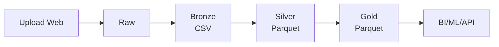

# Arquitetura de Camadas do Data Lake

## Visão Geral

O Data Lake está organizado em uma arquitetura Medallion com três camadas distintas (Bronze, Silver, Gold), cada uma com sua função específica no pipeline de processamento de dados.

---

## 📁 Estrutura de Diretórios no MinIO

```
bucket: lab01/
├── raw/                          # Área de landing (upload inicial)
│   └── {dag_id}/
│       └── {timestamp}_{hash}.csv
│
├── bronze/                       # Camada Bronze (dados brutos)
│   └── {target_table_name}/
│       └── {arquivo}.csv
│
├── silver/                       # Camada Silver (dados limpos)
│   └── {target_table_name}/
│       └── {arquivo}.parquet
│
└── gold/                         # Camada Gold (dados agregados)
    └── {target_table_name}/
        └── {arquivo}.parquet
```

---

## 🔄 Fluxo de Processamento

### 1️⃣ Raw (Área de Landing)
- **Origem**: Upload via aplicação web (CodeIgniter)
- **Formato**: CSV original
- **Localização**: `raw/{dag_id}/{timestamp}_{hash}.csv`
- **Características**:
  - Dados exatamente como foram recebidos
  - Nenhuma transformação aplicada
  - Mantido para auditoria e reprocessamento

### 2️⃣ Bronze (Dados Brutos)
- **Função**: `lib.bronze_layer.raw_to_bronze()`
- **Transformação**: Cópia direta de Raw → Bronze
- **Formato**: CSV (mesmo do original)
- **Localização**: `bronze/{target_table_name}/{arquivo}.csv`
- **Características**:
  - Dados brutos sem transformação
  - Primeira camada do Data Lake propriamente dito
  - Separado de Raw para organização

> **💡 Diferença entre Raw e Bronze:**
> 
> - **Raw** é a área de entrada temporária onde os arquivos chegam via upload, com nomeação baseada em timestamp/hash (`raw/{dag_id}/{timestamp}_{hash}.csv`). É uma área transitória que serve para auditoria e pode ser limpa periodicamente.
> 
> - **Bronze** é a primeira camada oficial do Data Lake, com organização estruturada por tabela (`bronze/{target_table_name}/{arquivo}.csv`). É o armazenamento permanente dos dados originais, onde começa o pipeline de transformações do medalhão.
> 
> Em resumo: Raw = "Caixa de entrada", Bronze = "Arquivo organizado permanente"

**Código:**
```python
from lib.bronze_layer import raw_to_bronze

raw_to_bronze(
    source_filename='raw/ingestao_customers_raw/file.csv',
    target_table_name='ingestao_customers_raw'
)
```

### 3️⃣ Silver (Dados Limpos)
- **Função**: `lib.silver_layer.bronze_to_silver()`
- **Transformações aplicadas**:
  - ✅ Remove linhas totalmente vazias (`dropna(how='all')`)
  - ✅ Remove registros duplicados (`drop_duplicates()`)
  - ✅ Converte para formato Parquet com compressão Snappy
- **Formato**: Parquet (colunar, otimizado)
- **Localização**: `silver/{target_table_name}/{arquivo}.parquet`
- **Características**:
  - Dados validados e limpos
  - Formato otimizado para analytics
  - Pronto para análise exploratória

**Código:**
```python
from lib.silver_layer import bronze_to_silver

bronze_to_silver(
    source_filename='raw/ingestao_customers_raw/file.csv',
    target_table_name='ingestao_customers_raw'
)
```

### 4️⃣ Gold (Dados Agregados)
- **Função**: `lib.gold_layer.silver_to_gold()`
- **Transformações aplicadas**:
  - 📊 Agregações de negócio (métricas, KPIs)
  - 🎯 Otimização para queries analíticas
  - 🔧 Parquet otimizado com PyArrow
- **Formato**: Parquet (altamente otimizado)
- **Localização**: `gold/{target_table_name}/{arquivo}.parquet`
- **Características**:
  - Dados prontos para consumo (BI, ML, APIs)
  - Máxima performance de leitura
  - Menor tamanho de arquivo

**Código:**
```python
from lib.gold_layer import silver_to_gold

silver_to_gold(
    source_filename='raw/ingestao_customers_raw/file.csv',
    target_table_name='ingestao_customers_raw'
)
```

---

## 🛠️ Configuração de DAGs

### Opções de Implementação

Existem **2 formas** de implementar a arquitetura Medallion:

---

#### 📦 **Opção 1: Pipeline Completo (Recomendado para Começar)**

**1 DAG processa todas as camadas** (Bronze → Silver → Gold) em uma única execução.

**Arquivo:** `lib.medallion_pipeline.raw_to_medallion`

**Configuração no MySQL:**

```sql
INSERT INTO dag_configurations (
    dag_id, 
    source_filename, 
    target_table_name, 
    python_module_path,
    is_active
) VALUES (
    'pipeline_customers',
    'raw/ingestao_customers_raw/file.csv',
    'customers',
    'lib.medallion_pipeline.raw_to_medallion',
    1
);
```

**Resultado:** 
- 1 registro no banco
- 1 execução cria Bronze + Silver + Gold automaticamente

✅ **Vantagens:**
- Mais simples de configurar e gerenciar
- Apenas 1 registro no banco por arquivo
- Execução atômica (tudo ou nada)
- Ideal para pipelines pequenos e médios

❌ **Desvantagens:**
- Se falhar em alguma camada, precisa reprocessar tudo
- Menos flexibilidade para reprocessar camadas individuais
- Não permite agendar camadas em horários diferentes

**Quando usar:**
- Pipelines novos
- Volumes de dados pequenos/médios
- Quando simplicidade é prioridade
- Quando todas as camadas devem ser processadas juntas

---

#### 🔗 **Opção 2: DAGs Separadas (Máximo Controle)**

**4 DAGs independentes**, uma para cada camada, permitindo controle granular.

**Arquivos:**
- `lib.bronze_layer.raw_to_bronze`
- `lib.silver_layer.bronze_to_silver`
- `lib.gold_layer.silver_to_gold`

**Configuração no MySQL:**

```sql
-- DAG 1: Bronze
INSERT INTO dag_configurations (
    dag_id, 
    source_filename, 
    target_table_name, 
    python_module_path,
    schedule_interval,
    is_active
) VALUES (
    'bronze_customers',
    'raw/ingestao_customers_raw/file.csv',
    'customers',
    'lib.bronze_layer.raw_to_bronze',
    '0 1 * * *',  -- 01:00 AM
    1
);

-- DAG 2: Silver
INSERT INTO dag_configurations (
    dag_id, 
    source_filename, 
    target_table_name, 
    python_module_path,
    schedule_interval,
    is_active
) VALUES (
    'silver_customers',
    'raw/ingestao_customers_raw/file.csv',
    'customers',
    'lib.silver_layer.bronze_to_silver',
    '0 2 * * *',  -- 02:00 AM (após Bronze)
    1
);

-- DAG 3: Gold
INSERT INTO dag_configurations (
    dag_id, 
    source_filename, 
    target_table_name, 
    python_module_path,
    schedule_interval,
    is_active
) VALUES (
    'gold_customers',
    'raw/ingestao_customers_raw/file.csv',
    'customers',
    'lib.gold_layer.silver_to_gold',
    '0 3 * * *',  -- 03:00 AM (após Silver)
    1
);
```

**Resultado:** 
- 3 registros no banco
- Cada camada pode ser executada/reprocessada independentemente

✅ **Vantagens:**
- Reprocessamento granular (só a camada que falhou)
- Pode agendar camadas em horários diferentes
- Facilita debug e manutenção
- Permite paralelizar processamento de múltiplas tabelas
- Ideal para produção com alto volume

❌ **Desvantagens:**
- 3-4 registros no banco por arquivo
- Precisa gerenciar dependências entre DAGs manualmente
- Configuração inicial mais complexa

**Quando usar:**
- Produção com alto volume de dados
- Quando precisa reprocessar camadas específicas frequentemente
- Quando diferentes camadas têm SLAs diferentes
- Quando quer paralelizar processamento

---

### Comparação Rápida

| Aspecto | Pipeline Completo | DAGs Separadas |
|---------|------------------|----------------|
| **Registros no banco** | 1 por arquivo | 3 por arquivo |
| **Complexidade** | ⭐ Baixa | ⭐⭐⭐ Alta |
| **Reprocessamento** | Tudo ou nada | Granular |
| **Flexibilidade** | ⭐⭐ Média | ⭐⭐⭐⭐⭐ Máxima |
| **Performance** | ⭐⭐⭐ Boa | ⭐⭐⭐⭐ Ótima |
| **Ideal para** | Início, MVP | Produção |

---

### Tabela MySQL: `dag_configurations`

Resumo dos valores possíveis para `python_module_path`:

| Função | Módulo | O que faz |
|--------|--------|-----------|
| **Pipeline Completo** | `lib.medallion_pipeline.raw_to_medallion` | Raw → Bronze → Silver → Gold (tudo) |
| **Bronze** | `lib.bronze_layer.raw_to_bronze` | Raw → Bronze (cópia CSV) |
| **Silver** | `lib.silver_layer.bronze_to_silver` | Bronze → Silver (limpeza + Parquet) |
| **Gold** | `lib.gold_layer.silver_to_gold` | Silver → Gold (agregação + otimização) |
| **Legado** | `lib.minio_tasks.transform_data_with_pandas` | ⚠️ Obsoleto (mantido para compatibilidade) |

---

## 📊 Pipeline Completo



**Sequência de Execução:**

1. **Upload**: Usuário faz upload via webapp → `raw/{dag_id}/file.csv`
2. **Bronze DAG**: Copia para `bronze/{table}/file.csv`
3. **Silver DAG**: Limpa e converte para `silver/{table}/file.parquet`
4. **Gold DAG**: Agrega e otimiza para `gold/{table}/file.parquet`
5. **Consumo**: PowerBI, APIs, ML models consomem de Gold

---

## 🔍 Validação de Dados

Cada camada possui uma task de validação que verifica a existência do arquivo processado:

```python
# Validação Silver (exemplo no factory_master.py)
def validate_processed_file(**context):
    """Valida se o arquivo Silver (Parquet) existe no MinIO."""
    hook = S3Hook(aws_conn_id='minio_conn')
    basename_no_ext = os.path.splitext(basename)[0]
    silver_key = f"silver/{target_name}/{basename_no_ext}.parquet"
    
    if hook.check_for_key(silver_key, bucket_name='lab01'):
        log.info(f"✅ Arquivo Silver encontrado: {silver_key}")
        return True
    else:
        log.warning(f"❌ Arquivo Silver não encontrado: {silver_key}")
        return False
```

---

## 📝 Arquivos do Sistema

### Funções de Transformação

| Arquivo | Função | Responsabilidade | Quando Usar |
|---------|--------|-----------------|-------------|
| `src/dags/lib/medallion_pipeline.py` | `raw_to_medallion()` | **Pipeline Completo**: Raw → Bronze → Silver → Gold | ⭐ Recomendado para começar |
| `src/dags/lib/bronze_layer.py` | `raw_to_bronze()` | Raw → Bronze | DAGs separadas |
| `src/dags/lib/silver_layer.py` | `bronze_to_silver()` | Bronze → Silver | DAGs separadas |
| `src/dags/lib/gold_layer.py` | `silver_to_gold()` | Silver → Gold | DAGs separadas |
| `src/dags/lib/minio_tasks.py` | `transform_data_with_pandas()` | ⚠️ **Legado** (substituído) | Compatibilidade |

### Orquestração

| Arquivo | Responsabilidade |
|---------|-----------------|
| `src/dags/factory_master.py` | Gera DAGs dinamicamente a partir do MySQL |
| `docker compose.yml` | Configura Airflow Scheduler, Worker, MinIO, MySQL |

---

## 🚀 Como Usar

### Opção 1: Pipeline Completo (Início Rápido)

#### 1. Fazer Upload de Arquivo

Acesse a aplicação web e faça upload de um CSV:
- URL: `http://localhost:8088`
- O arquivo será salvo em `raw/{dag_id}/{timestamp}_{hash}.csv`

#### 2. Configurar DAG no MySQL

```sql
UPDATE dag_configurations 
SET python_module_path = 'lib.medallion_pipeline.raw_to_medallion'
WHERE dag_id = 'ingestao_customers_raw';
```

#### 3. Executar DAG

No Airflow UI (`http://localhost:8085`):
1. Localize a DAG (ex: `ingestao_customers_raw4`)
2. Clique em "Trigger DAG"
3. Acompanhe a execução

#### 4. Verificar Resultado

```bash
# Verificar todas as camadas criadas
docker compose exec minio ls -lh /data/lab01/bronze/ingestao_customers_raw/
docker compose exec minio ls -lh /data/lab01/silver/ingestao_customers_raw/
docker compose exec minio ls -lh /data/lab01/gold/ingestao_customers_raw/
```

---

### Opção 2: DAGs Separadas (Controle Granular)

#### 1. Criar Configurações no MySQL

```sql
-- Bronze
INSERT INTO dag_configurations (
    dag_id, source_filename, target_table_name, 
    python_module_path, schedule_interval, is_active
) VALUES (
    'bronze_customers', 'raw/customers/file.csv', 'customers',
    'lib.bronze_layer.raw_to_bronze', '0 1 * * *', 1
);

-- Silver
INSERT INTO dag_configurations (
    dag_id, source_filename, target_table_name, 
    python_module_path, schedule_interval, is_active
) VALUES (
    'silver_customers', 'raw/customers/file.csv', 'customers',
    'lib.silver_layer.bronze_to_silver', '0 2 * * *', 1
);

-- Gold
INSERT INTO dag_configurations (
    dag_id, source_filename, target_table_name, 
    python_module_path, schedule_interval, is_active
) VALUES (
    'gold_customers', 'raw/customers/file.csv', 'customers',
    'lib.gold_layer.silver_to_gold', '0 3 * * *', 1
);
```

#### 2. Executar em Sequência

No Airflow UI:
1. Execute `bronze_customers`
2. Aguarde conclusão
3. Execute `silver_customers`
4. Aguarde conclusão
5. Execute `gold_customers`

#### 3. Automatizar com Schedule

As DAGs rodarão automaticamente nos horários configurados:
- 01:00 AM - Bronze
- 02:00 AM - Silver
- 03:00 AM - Gold

---

## 🔧 Troubleshooting

### Arquivo não encontrado na camada Silver/Gold

**Problema**: DAG falha com "404 Not Found"

**Solução**: 
1. Verifique se a DAG anterior foi executada com sucesso
2. Confirme que o arquivo existe na camada anterior:
   ```bash
   docker compose exec minio ls /data/lab01/bronze/{table}/
   ```

### Python module not found

**Problema**: `ModuleNotFoundError: No module named 'lib'`

**Solução**:
1. Verifique que os arquivos estão em `src/dags/lib/`
2. Reinicie o Airflow Scheduler:
   ```bash
   docker compose restart airflow-scheduler
   ```

### Erro ao ler Parquet

**Problema**: `pyarrow.lib.ArrowInvalid`

**Solução**:
1. Verifique se pandas e pyarrow estão instalados no `requirements.txt`
2. Recrie a imagem Docker:
   ```bash
   docker compose build airflow-scheduler
   ```

---

## 📚 Dependências

### Python Packages (requirements.txt)

```txt
pandas>=2.0.0
pyarrow>=14.0.0
apache-airflow-providers-amazon>=8.0.0
```

### Variáveis de Ambiente

```env
MINIO_BUCKET=lab01
MINIO_ENDPOINT=http://minio:9000
MINIO_ACCESS_KEY_ID=admin
MINIO_SECRET_ACCESS_KEY=admin123
```

---

## 📅 Histórico de Mudanças

### 2025-11-23 - Refatoração de Camadas

**Mudanças:**
- ✅ Criada estrutura separada por camadas (Bronze, Silver, Gold)
- ✅ Criado pipeline completo Medallion em arquivo único
- ✅ Separadas funções de transformação em arquivos específicos
- ✅ Implementada limpeza de dados na camada Silver
- ✅ Adicionada conversão para Parquet com compressão
- ✅ Mantida compatibilidade com `minio_tasks.py` legado
- ✅ Documentadas 2 opções de implementação (Pipeline Completo vs DAGs Separadas)

**Arquivos Criados:**
- `src/dags/lib/medallion_pipeline.py` ⭐ **Novo - Pipeline completo**
- `src/dags/lib/bronze_layer.py`
- `src/dags/lib/silver_layer.py`
- `src/dags/lib/gold_layer.py`

**Arquivos Modificados:**
- `src/dags/factory_master.py` (validação agora verifica Silver)
- `src/dags/lib/minio_tasks.py` (marcado como legado)

**Recomendação:**
- Novos projetos: Use `medallion_pipeline.raw_to_medallion`
- Projetos existentes: Migre gradualmente para camadas separadas

---

## 📖 Referências

- [Databricks Medallion Architecture](https://www.databricks.com/glossary/medallion-architecture)
- [Apache Airflow Best Practices](https://airflow.apache.org/docs/apache-airflow/stable/best-practices.html)
- [Apache Parquet Documentation](https://parquet.apache.org/docs/)
- [MinIO Python SDK](https://min.io/docs/minio/linux/developers/python/API.html)
