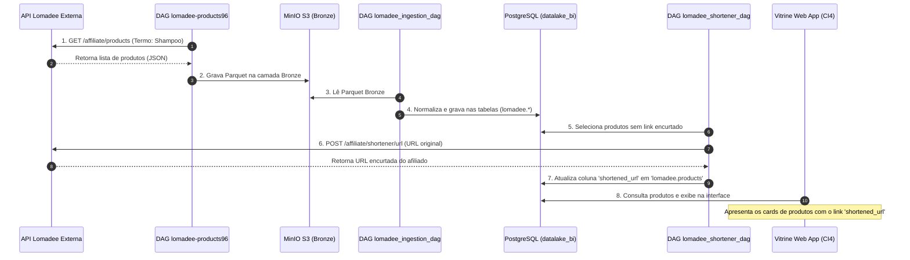

# 🛍️ Pipeline de Ingestão de Produtos Lomadee

Este documento explica em detalhes o funcionamento do pipeline de dados responsável por extrair, normalizar e enriquecer os dados de produtos afiliados da Lomadee para alimentar a **Vitrine de Ofertas**.

---

## 🏗️ Visão Geral da Arquitetura

O pipeline de dados é dividido em 3 etapas consecutivas, cada uma gerenciada por uma DAG dedicada no Airflow. Isso garante o desacoplamento das tarefas, permitindo que a falha em uma etapa (ex: instabilidade temporária na API externa) não afete o estado da etapa anterior.

```text
┌───────────────────────┐      ┌────────────────────────┐      ┌────────────────────────┐
│   1. Ingestao (API)   │      │    2. Normalizacao     │      │   3. Enriquecimento    │
│  lomadee-products96   │  ──> │  lomadee_ingestion_dag │  ──> │ lomadee_shortener_dag  │
│  (MinIO Bronze/Raw)   │      │ PostgreSQL - BI Schema │      │  (Links de Afiliados)  │
└───────────────────────┘      └────────────────────────┘      └────────────────────────┘
```

---

## 🔍 Detalhamento das 3 DAGs do Fluxo

### 1️⃣ `lomadee-products96` (Dynamic / DAG Dinâmica)
* **Tipo:** DAG Dinâmica gerada automaticamente por metadados.
* **Mecanismo:** Criada pelo [factory_master.py](file:///root/datalake-air-flow-delta/src/dags/factory_master.py) a partir do registro de configuração **ID 96** na tabela `dag_configurations` do banco de dados MySQL.
* **Propósito:** Ingestão de dados brutos (*Raw/Bronze*).
* **Funcionamento:**
  * Executa a função Python `lib.medallion_pipeline_v2.raw_to_medallion`.
  * Realiza uma chamada HTTP `GET` à API oficial da Lomadee (`https://api.lomadee.com.br/affiliate/products`).
  * Utiliza parâmetros de busca configurados no banco de dados (ex: termo de busca `"shampoo"`, limite de `50` registros, cabeçalhos de autenticação com chave de desenvolvedor).
  * Salva o payload JSON resultante diretamente em formato Parquet no **MinIO (S3)** sob o caminho `s3://paulomnasc-558/bronze/lomadee-products/*.parquet`.

---

### 2️⃣ `lomadee_ingestion_dag` (Bronze Lomadee Normalized)
* **Tipo:** DAG Estática definida em arquivo.
* **Mecanismo:** Definida em [lomadee_ingestion_dag.py](file:///root/datalake-air-flow-delta/src/dags/lomadee_ingestion_dag.py).
* **Propósito:** Normalização e Carga Relacional (*Bronze/Silver*).
* **Funcionamento:**
  * Dispara o script python [load_lomadee.py](file:///root/datalake-air-flow-delta/scripts/load_lomadee.py) dentro do ambiente do Airflow.
  * Consome os arquivos Parquet estruturados que foram persistidos na camada Bronze do MinIO.
  * Trata, limpa e normaliza os dados de produtos.
  * Distribui os registros nas respectivas tabelas do PostgreSQL no banco de dados `datalake_bi` sob o esquema `lomadee`:
    * `lomadee.products` (Dados do produto como nome, preço, link original)
    * `lomadee.categories` (Categorias de produtos)
    * `lomadee.product_categories` (Tabela pivô de relacionamento N:N)
    * `lomadee.product_images` (Galeria de imagens dos produtos)
    * `lomadee.product_options` (Variações dos produtos)

---

### 3️⃣ `lomadee_shortener_dag` (api lomadee shortener)
* **Tipo:** DAG Estática definida em arquivo.
* **Mecanismo:** Definida em [lomadee_shortener_dag.py](file:///root/datalake-air-flow-delta/src/dags/lomadee_shortener_dag.py).
* **Propósito:** Enriquecimento de Dados (*Affiliate Tracking Link*).
* **Funcionamento:**
  * Dispara o script python [shorten_lomadee_urls.py](file:///root/datalake-air-flow-delta/scripts/shorten_lomadee_urls.py).
  * Lê a tabela `lomadee.products` no PostgreSQL para buscar as URLs de vendas originais dos produtos.
  * Envia cada URL original para a API de Encurtamento de Links da Lomadee (`https://api.lomadee.com.br/affiliate/shortener/url`) com as credenciais do afiliado.
  * Recebe o link de rastreamento encurtado (que garante as comissões das vendas).
  * Salva o link retornado na coluna `shortened_url` da tabela `lomadee.products`.

---

## 📊 Fluxo de Dados de Fim a Fim

O diagrama abaixo ilustra o fluxo completo do pipeline até a disponibilização na vitrine final:



---

## 🛠️ Tecnologias Envolvidas

* **Apache Airflow:** Orquestrador das tarefas e do tempo de execução das DAGs.
* **MinIO (S3 API):** Armazenamento em arquivos Parquet de alta performance na camada Bronze.
* **PostgreSQL:** Banco de dados de BI (`datalake_bi`) que serve a camada de consulta da vitrine.
* **DuckDB:** Utilizado nos bastidores do script de ingestão para fazer consultas SQL eficientes e ler os Parquet diretamente na AWS S3 API de forma extremamente rápida.
* **CodeIgniter 4:** O backend da Vitrine de Ofertas que expõe endpoints `/api/products` acessando diretamente a tabela `lomadee.products` no PostgreSQL.
