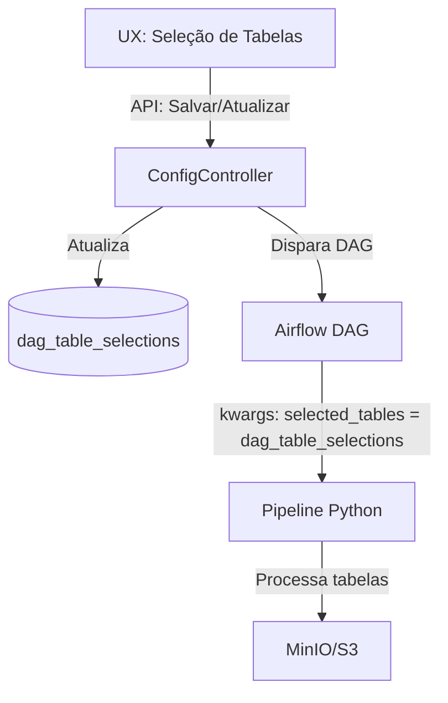

# Plano de Mudança: Seleção Dinâmica de Tabelas no Pipeline Medallion

## Objetivo
Permitir que a UX (frontend) altere dinamicamente a lista de tabelas selecionadas para o pipeline Medallion, garantindo que o backend (ConfigController) atualize corretamente a tabela `dag_table_selections` e que o pipeline Python processe as tabelas corretas. Incluir testes de fluxo completo.

---

## Mudanças Propostas

### 1. Frontend (UX)

### 2. Backend (PHP)

### 3. Pipeline Python (Airflow)

## Testes de Fluxo Completo

### Teste 1: Criação de Pipeline

### Teste 2: Edição de Pipeline

### Teste 3: Remoção de Tabela

### Teste 4: Adição de Tabela

## Fluxo de Interação Frontend/Backend/Pipeline

### Descrição do Fluxo
1. O usuário seleciona/edita as tabelas na UX.
2. A UX envia a lista para o backend via API.
3. O backend salva/atualiza as seleções em `dag_table_selections`.
4. Ao disparar a DAG, o backend injeta `selected_tables` nos kwargs, onde `selected_tables = dag_table_selections`.
5. O pipeline Python processa apenas as tabelas informadas.
6. Resultados são salvos no MinIO/S3.

## Observações

## Checklist de Implementação

---

## Classes e Métodos a Refatorar

### Backend (PHP)
- **ConfigController**
    - Métodos: `insert`, `update`, `saveTableSelections`, `getTableSelections`
    - Objetivo: Garantir que a seleção de tabelas seja salva, atualizada e recuperada corretamente de `dag_table_selections`.

### Pipeline Python (Airflow)
- **factory_master.py**
    - Método: `fetch_selected_tables`
    - Objetivo: Buscar as tabelas selecionadas de `dag_table_selections` e propagar via kwargs.
- **medallion_pipeline_v2.py**
    - Função: `raw_to_medallion`
    - Classe: `RawToMedallionPipeline`
    - Objetivo: Garantir que o parâmetro `selected_tables` seja tratado corretamente e que o pipeline processe apenas as tabelas informadas.

### Frontend (UX)
- **Classe/Componente de Edição de Pipeline**
    - Métodos: Interface de seleção/edição de tabelas
    - Objetivo: Permitir ao usuário editar dinamicamente a lista de tabelas selecionadas.
