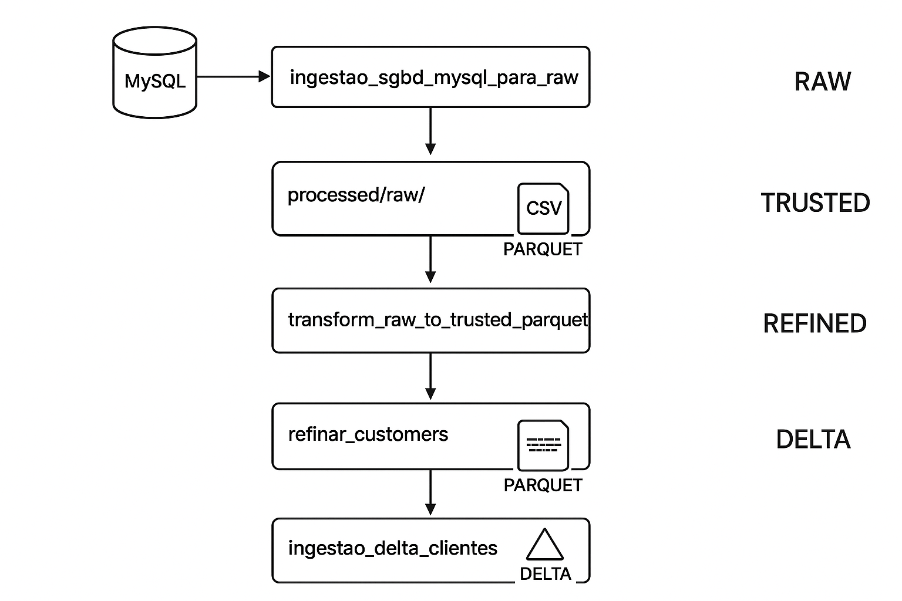
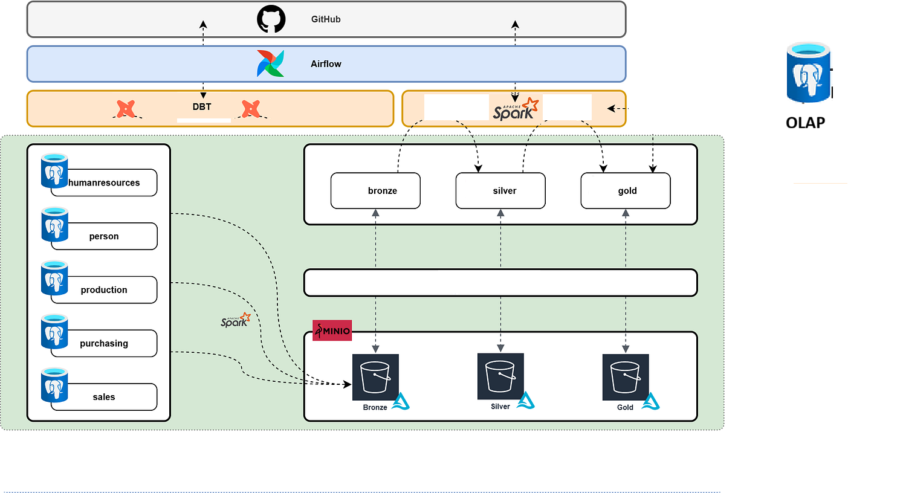

Copyright (C) 2026 Paulo Nascimento - Este programa é um software livre licenciado sob a GNU Affero General Public License v3.

# Modern Data Stack - Solução Híbrida: Apache Airflow + PostgreSQL + MinIO + Delta Lake + Metabase


Este projeto integra componentes principais de uma Modern Data Stack para orquestração de dados, armazenamento e visualização:

- **Apache Airflow**: Orquestração de workflows e pipelines de dados
- **PostgreSQL**: Banco de dados relacional para metadados do Airflow **+ BI endpoint** (postgres-bi)
- **MinIO**: Armazenamento de objetos compatível com S3 (Data Lake)
- **Delta Lake**: Camada ACID sobre Data Lake com versionamento e time travel (camada Gold)
- **dbt (Data Build Tool)**: Transformações de dados, qualidade de dados e documentação/linhagem de metadados
- **Metabase**: Ferramenta de Business Intelligence e visualização de dados analíticos

A base foi adaptada para incluir os três serviços integrados. Os artefatos de código (DAGs, scripts, configurações) estão versionados neste repositório.

## 🏗️ Visão Arquitetural

Abaixo estão os diagramas conceituais e arquiteturais do projeto:

### 1. Arquitetura de Dados com dbt


### 2. Fluxo de Dados e Camadas do Datalake


### 3. Painel de Orquestração e Analytics (Airflow)


---

## 📚 Documentação Completa

Para entender a arquitetura Medallion (Bronze → Silver → Gold) e todas as transformações aplicadas, consulte o **[Índice de Documentação](DOCS_INDEX.md)**.

### 🎯 Guias de Uso

- **[📋 Guia da Interface Web](GUIDE_WEBAPP_CONFIG.md)**: Como preencher formulário de configuração de DAGs, multi-tabela, conexões SQL, validações
- **[🔌 Conexão Power BI](MIGRACAO_DUCKDB_POSTGRESQL.md)** ⭐: PostgreSQL para BI (solução robusta, múltiplas tabelas simultâneas)

### Documentação por Camada

- **[Transformações Silver](TRANSFORMACOES_SILVER.md)**: Data Quality, validações, dicionário de dados
- **[Delta Lake & Gold](DELTA_LAKE_IMPLEMENTATION.md)**: Feature Engineering, Delta Lake, ML/BI integration

### Navegação Rápida por Caso de Uso

- **Machine Learning**: [Feature Engineering Guide](DELTA_LAKE_IMPLEMENTATION.md#-dicionário-de-dados---camada-gold-delta-lake)
- **Análise Temporal**: [Temporal Features](DELTA_LAKE_IMPLEMENTATION.md#5-features-temporais-date-columns)
- **Qualidade de Dados**: [Data Quality Dictionary](TRANSFORMACOES_SILVER.md#-dicionário-de-dados---camadas-silver)
- **Segmentação**: [Categorical Features](DELTA_LAKE_IMPLEMENTATION.md#4-features-categóricas-categorical-columns)
- **Detecção de Outliers**: [Statistical Features](DELTA_LAKE_IMPLEMENTATION.md#3-features-numéricas-numeric-columns)

---

## 💻 Configuração de Hardware

### ⚙️ Stack Completa

Esta solução executa simultaneamente:
- **Apache Airflow** (Webserver + Scheduler)
- **PostgreSQL** (metadados Airflow) + **postgres-bi** (endpoint BI/Power BI)
- **MySQL** (banco de dados de origem para ingestão)
- **MinIO** (armazenamento S3-compatible)
- **Apache Spark** (processamento distribuído)
- **dbt (Data Build Tool)** (modelagem analítica, qualidade e linhagem de dados)
- **Delta Lake** (camada ACID sobre data lake)
- **Metabase** (ferramenta de BI e dashboards de negócio)

#### 🐳 Serviços Docker

| Service ID | Nome do Serviço | Descrição |
|------------|----------------|-----------|
| `airflow-webserver` | Apache Airflow (Webserver) | Interface web para orquestração de workflows |
| `airflow-scheduler` | Apache Airflow (Scheduler) | Agendamento e execução de DAGs |
| `airflow-worker` | Airflow Worker | Executor Celery para processamento de tarefas |
| `postgres` | PostgreSQL | Banco de dados de metadados do Airflow |
| `postgres-bi` | PostgreSQL (BI) | Endpoint para Power BI/ferramentas de analytics (porta 5433) |
| `mysql` | MySQL | Banco de dados de origem para ingestão |
| `minio` | MinIO | Armazenamento S3-compatible para data lake |
| `spark` | Apache Spark (Master) | Nó master do cluster de processamento distribuído |
| `spark-worker` | Spark Worker | Nó worker do cluster Spark |
| `dbt` | dbt Core | Modelagem analítica, qualidade e documentação de metadados |
| `metabase` | Metabase | Ferramenta de BI e visualização de dados analíticos |
| `redis` | Redis | Broker de mensagens para Celery Executor |
| `codeigniter-app` | CodeIgniter WebApp | Interface web para configuração de DAGs |

### 📊 Requisitos Mínimos (Desenvolvimento/Teste)

**Stack Completa (todos os serviços ativos):**
- **Disco:** 50 GB mínimo (recomendado 100 GB)
  - Imagens Docker: ~10-15 GB
  - MinIO storage: ~10-20 GB
  - Logs, dbt e Delta Lake: ~10-20 GB
- **Memória:** 16 GB de RAM
  - Airflow: ~3 GB
  - PostgreSQL (Airflow + BI): ~3 GB
  - MySQL: ~1 GB
  - MinIO: ~512 MB
  - Metabase: ~1.5 GB
  - dbt e Spark: ~4.5 GB
  - DuckDB pgwire: leve (<1 GB em uso típico)
  - Sistema: ~2 GB
- **Processador:** 2-4 CPUs (ou vCPUs)

### 🚀 Requisitos Recomendados (Produção)

- **Disco:** 200+ GB (SSD recomendado)
- **Memória:** 32-64 GB de RAM
- **Processador:** 8+ CPUs
- **Rede:** 1 Gbps+

### 📝 Considerações Adicionais

**Otimização de Recursos:**
- Configure limites de memória no docker-compose.yml para cada serviço
- Use swap apenas como fallback (pode degradar performance)

**Sistema Operacional:**
- **Linux:** Melhor performance e compatibilidade nativa
- **WSL2:** Funcional, mas configure memória adequada no `.wslconfig`
- **Windows:** Não recomendado para produção

**Ambientes Cloud:**
- **AWS (MWAA):** Custos variáveis por uso (a partir de ~$350/mês)
- **GCP/Azure:** Similar, com opções de managed services
- **Kubernetes:** Requer orquestração adicional, mas escala horizontalmente 

## 📁 Estrutura do Projeto

```
airflow-spark-minio-postgres/
├── docker compose.yml
├── Dockerfile
├── entrypoint.sh
└── src/
    └── dags/
        └── suas_dags.py
```

---

## ⚙️ Etapas de Implantação

### 1. Clonar o Projeto

```bash
git clone https://github.com/paulomnasc/datalake-air-flow.git
cd datalake-air-flow
```

> Substitua o link acima pelo repositório real, se necessário.

---

### 2. Build e Inicialização dos Containers

```bash
chmod +x entrypoint.sh
docker compose down --remove-orphans
docker compose build
docker compose up -d
```

## 2.1 Verifique os containers ativos

```bash
docker ps
```


> Neste momento:
> - O **PostgreSQL** é instanciado com o banco `airflow`, usuário `airflow` e senha `airflow`
> - O **MinIO** é iniciado com o volume `/data` e console web na porta 9001
> - O **Airflow Webserver e Scheduler** são construídos e iniciados com base nas variáveis de ambiente

---

### 2.1 Passo opcional de verificação se o Airflow está Up (opercional)
```bash
docker exec -it airflow-webserver airflow dags list

```

### 3. Inicializar o Banco de Dados do Airflow (! Apenas novas instalações)

```bash
docker exec -it airflow-webserver airflow db init
```

> Esse comando aplica as migrações e cria as tabelas no banco `airflow` do PostgreSQL.

---

### 4. Criar Usuário Admin no Airflow (! Apenas novas instalações)

Via CLI:

```bash
docker exec -it airflow-webserver airflow users create \
  --username admin \
  --firstname Air \
  --lastname Flow \
  --role Admin \
  --email admin@example.com \
  --password *******
```

#### 4.1 Governança de Acesso: Roles por Usuário (prefixo-idusuario)

Para isolar a visibilidade de DAGs por usuário, utilizamos um papel específico por usuário no Airflow, igual ao seu `username` (ex.: `eng-147`).

- A aplicação tenta criar automaticamente este papel via API no momento do login. Se a API do Airflow não aceitar criação (HTTP 500), o usuário é criado/atualizado com `Viewer` e você pode criar o papel via CLI/UI.
- Assim que o papel existir, ele será anexado automaticamente ao usuário no próximo login.

Comandos CLI (alternativa confiável):

```bash
docker exec -it airflow-webserver airflow roles list
docker exec -it airflow-webserver airflow roles create eng-147
docker exec -it airflow-webserver airflow users add-role --username eng-147 --role eng-147
```

Validação na UI:
- Security → List Roles: verificar `eng-147`
- Security → List Users → `eng-147`: verificar que possui `Viewer` + `eng-147`

---

### 5. Configurar Conexões do Airflow (! Obrigatório)

#### 5.1 Conexão MinIO (minio_conn)

A conexão com o MinIO é **obrigatória** para que as DAGs possam acessar o armazenamento S3-compatible.

**Opção 1: Via CLI (recomendado para automação)**

```bash
docker exec airflow-webserver airflow connections add minio_conn \
  --conn-type aws \
  --conn-login admin \
  --conn-password ******* \
  --conn-extra '{"endpoint_url": "http://minio:9000"}'
```

**Opção 2: Via Interface Web do Airflow**

1. Acesse: [http://localhost:8085](http://localhost:8085) → Login: `admin` / `*******`
2. Menu: **Admin** → **Connections** → **+** (Add a new record)
3. Preencha os campos:
   - **Connection Id**: `minio_conn`
   - **Connection Type**: `Amazon Web Services`
   - **AWS Access Key ID**: `admin`
   - **AWS Secret Access Key**: `*******`
   - **Extra**: `{"endpoint_url": "http://minio:9000"}`
4. Clique em **Save**

**Parâmetros:**
- `conn-type`: `aws` (MinIO é compatível com S3)
- `conn-login`: `admin` (usuário configurado no docker-compose)
- `conn-password`: `*******` (senha configurada no docker-compose)
- `endpoint_url`: `http://minio:9000` (endpoint interno do container)

#### 5.2 Conexão MySQL para DAGs Dinâmicas (mysql_dag_metadata)

Se você usa o sistema de DAGs dinâmicas baseadas em configuração MySQL, crie também esta conexão.

**Opção 1: Via CLI (recomendado para automação)**

```bash
docker exec airflow-webserver airflow connections add mysql_dag_metadata \
  --conn-type mysql \
  --conn-host mysql \
  --conn-schema lista_revisao2 \
  --conn-login root \
  --conn-password ******* \
  --conn-port 3306
```

**Opção 2: Via Interface Web do Airflow**

1. Acesse: [http://localhost:8085](http://localhost:8085) → **Admin** → **Connections** → **+**
2. Preencha os campos:
   - **Connection Id**: `mysql_dag_metadata`
   - **Connection Type**: `MySQL`
   - **Host**: `mysql`
   - **Schema**: `lista_revisao2`
   - **Login**: `root`
   - **Password**: `*******`
   - **Port**: `3306`
3. Clique em **Save**

**Parâmetros:**
- `conn-type`: `mysql`
- `conn-host`: `mysql` (nome do container)
- `conn-schema`: `lista_revisao2` (banco de dados com tabela `dag_configurations`)
- `conn-login`: `root`
- `conn-password`: `*******`
- `conn-port`: `3306`

> 📝 **Nota:** Essas conexões são persistidas no banco de metadados do Airflow (PostgreSQL) e sobrevivem a reinicializações dos containers. Porém, se você executar `docker-compose down -v` (que remove volumes), será necessário recriá-las.

---

### 6. Instalação de Dependências Python

Este projeto utiliza o Airflow com integração ao MinIO via S3Hook. Para garantir que todos os operadores e hooks estejam disponíveis, instale os seguintes pacotes:

```bash
pip install apache-airflow-providers-amazon
```
⚠️ Atenção: o pacote `oci` requer `cryptography < 46.0.0`. Se houver conflito, recomenda-se usar:

```bash
pip install cryptography==45.0.0
```

Ou instalar o provedor Amazon sem dependências:

``` bash
pip install apache-airflow-providers-amazon --no-deps
```


---


### 7. Ajustando Limite de Upload no Nginx (Erro 413 Request Entity Too Large)
---

#### Como acessar e editar arquivos dentro do container Nginx

Se você precisa editar ou inspecionar arquivos diretamente dentro do container Nginx:

1. Descubra o nome do container Nginx em execução:
  ```bash
  docker ps
  ```
  Procure pelo container relacionado ao Nginx.

2. Acesse o shell do container:
  ```bash
  docker exec -it NOME_DO_CONTAINER /bin/sh
  # ou, se disponível:
  docker exec -it NOME_DO_CONTAINER /bin/bash
  ```

3. Navegue pelas pastas normalmente:
  ```bash
  cd /etc/nginx
  ls
  ```

4. Edite arquivos com vi, nano ou outro editor disponível no container.

> Dica: O ideal é manter a configuração customizada fora do container e montar via volumes, mas para testes rápidos ou debugging, esse acesso direto pode ser útil.

---

Se ao fazer upload de arquivos grandes você receber o erro:

```
413 Request Entity Too Large
nginx/1.x.x
```

E sua stack estiver containerizada (Docker), siga os passos abaixo para aumentar o limite de upload do Nginx:

1. **Localize o arquivo de configuração do Nginx usado no container** (exemplo: `nginx.conf` ou um arquivo em `conf.d/`).

2. **Adicione ou ajuste a diretiva** dentro do bloco `http` ou `server`:
  ```nginx
  client_max_body_size 100M;
  ```
  > Altere `100M` para o tamanho desejado.

3. **Garanta que o arquivo de configuração customizado está sendo montado no container** no seu `docker-compose.yml`:
  ```yaml
  services:
    nginx:
     image: nginx:latest
     volumes:
      - ./nginx.conf:/etc/nginx/nginx.conf:ro
     # ou, se usar sites-enabled/conf.d:
      - ./meu-site.conf:/etc/nginx/conf.d/default.conf:ro
  ```

4. **Reinicie o container do Nginx:**
  ```bash
  docker-compose restart nginx
  ```

5. **Tente novamente o upload.**

> Se o erro persistir, verifique também as configurações de upload do PHP (`upload_max_filesize` e `post_max_size` no `php.ini`).

---


---

## 🌐 Consoles Administrativas e Acesso

| Serviço             | Endereço de Acesso                     | Porta | Usuário / Senha           | Banco de Dados     | Observações                          |
|---------------------|----------------------------------------|-------|----------------------------|--------------------|--------------------------------------|
| **Portainer**       | [http://localhost:9000](http://localhost:9000) | 9000  | `admin` / `*******`        | —                  | Console web para monitoramento Docker |
| **Airflow UI**      | [http://localhost:8085](http://localhost:8085) | 8085  | `admin` / `*******`        | —                  | Criado após `airflow db init` e `users create` |
| **MinIO Console**   | [http://localhost:9001](http://localhost:9001) | 9001  | `admin` / `*******`        | —                  | Interface web de armazenamento S3   |
| **MinIO API S3**    | `http://localhost:9000`                | 9000  | `admin` / `*******`        | —                  | Usado por boto3, S3Hook, etc.        |
| **PostgreSQL (Airflow)** | via cliente externo ou terminal   | 5432  | `airflow` / `*******`      | `airflow`          | Banco de metadados do Airflow        |
| **PostgreSQL (BI)** | via Power BI/cliente SQL               | 5433  | `pbi_user` / `*******`     | `datalake_bi`      | Endpoint para ferramentas de analytics (múltiplas conexões) |
| **dbt Docs**        | Acessível via painel webapp / dbt Docs  | —     | —                          | —                  | Documentação e linhagem de metadados |
| **Metabase**        | [http://localhost:3000](http://localhost:3000) | 3000  | `admin@estudotabela.com.br` / `*******` | `datalake_bi` | Ferramenta de BI e painéis analíticos |
| **CodeIgniter WebApp** | [http://localhost:8088](http://localhost:8088) | 8088  | Configurável via aplicação | `lista_revisao2`   | Interface web para configuração de DAGs |

---

## 🔌 Conexão Power BI via PostgreSQL

### ✅ Solução Atual (PostgreSQL BI)

**Por que PostgreSQL?**
- ✅ Suporte nativo a múltiplas conexões simultâneas
- ✅ Power BI pode acessar várias tabelas ao mesmo tempo
- ✅ Padrão de mercado para BI/Analytics
- ✅ Escalável e robusto

### 🤖 Sincronização Automática

A DAG `sync_delta_to_postgres` mantém as tabelas do PostgreSQL sempre atualizadas:

1. **Ative a DAG** no Airflow UI (http://localhost:8085):
   - Procure `sync_delta_to_postgres`
   - Toggle ON
   - Clique em "Trigger DAG" para executar manualmente

2. **Tabelas criadas automaticamente**:
   - Descoberta dinâmica de Delta tables no MinIO
   - Sincronização diária às 02:00 AM
   - Dados materializados (sem dependência de S3 em tempo de consulta)

### 📊 Conectar Power BI Desktop

1. **Obter Dados** → **PostgreSQL database**

2. **Preencher conexão**:
   ```
   Server: localhost:5433
   Database: datalake_bi
   ```

3. **Autenticação**:
   - Tipo: Database
   - Username: `pbi_user`
   - Password: `*******`

4. **Selecionar Tabelas**:
   - Navigator mostrará todas as tabelas `delta_*`
   - ✅ Selecione múltiplas tabelas simultaneamente (sem locks!)

### 🛠️ Verificar Tabelas Disponíveis

```bash
# Listar todas as tabelas
docker compose exec -T postgres-bi \
  psql -U pbi_user -d datalake_bi \
  -c "SELECT tablename FROM pg_tables WHERE schemaname='public';"

# Contar registros
docker compose exec -T postgres-bi \
  psql -U pbi_user -d datalake_bi \
  -c "SELECT tablename, n_live_tup as rows FROM pg_stat_user_tables;"
```

📖 **Documentação completa da migração**: [`MIGRACAO_DUCKDB_POSTGRESQL.md`](./MIGRACAO_DUCKDB_POSTGRESQL.md)

---

## 🔧 Configuração da Aplicação CodeIgniter

### ⚠️ Permissões de Escrita (Pasta `writable`)

A aplicação CodeIgniter requer permissões de escrita na pasta `writable` **dentro do container** para funcionar corretamente. Essa pasta armazena:
- **Logs** (`writable/logs`): Arquivos de log da aplicação
- **Cache** (`writable/cache`): Arquivos temporários de cache
- **Session** (`writable/session`): Dados de sessão de usuários
- **Uploads** (`writable/uploads`): Arquivos enviados via upload
- **Configs** (`writable/configs`): Configurações geradas via interface web

### 📝 Configuração de Permissões

#### Opção 1: Corrigir Permissões em Container em Execução

Se o container já está rodando e apresenta erros de permissão:

```bash
# Acessar o container
docker exec -it codeigniter-app bash

# Dentro do container, ajustar permissões
chown -R www-data:www-data /var/www/html/writable
chmod -R 755 /var/www/html/writable

# Sair do container
exit

# Reiniciar para aplicar mudanças
docker-compose restart codeigniter-app
```

#### Opção 2: Permissões no Host (Apenas se Volume Mapeado)

Como o código está mapeado via volume no `docker-compose.yml`, você também pode ajustar permissões no host:

```bash
# No host (fora do container)
# Criar estrutura se não existir
mkdir -p src/codeigniter-app/writable/{logs,cache,session,uploads,configs}

# Ajustar permissões (use o UID/GID do www-data do container)
# O padrão geralmente é 33:33 ou 1000:1000 dependendo da config
sudo chown -R 33:33 src/codeigniter-app/writable
chmod -R 755 src/codeigniter-app/writable

# Ou permitir escrita para todos (apenas desenvolvimento)
chmod -R 777 src/codeigniter-app/writable
```

#### Correção para bind-mounts (quando `chown` falha dentro do container)

Se o diretório `writable` está montado do host (bind-mount), executar `chown` dentro do container pode falhar com "Operation not permitted". Isso acontece porque a propriedade do arquivo é gerida pelo host. Procedimento recomendado:

```bash
# 1. Identificar o bind-mount e o caminho no host (ex.: service `codeigniter-app` monta src/codeigniter-app -> /var/www/html)
docker inspect -f '{{.Name}} {{range .Mounts}}{{.Source}}->{{.Destination}};{{end}}' $(docker ps -aq) | grep /var/www/html || true

# 2. Verificar UID do usuário web dentro do container (ex.: www-data)
docker exec -it codeigniter-app id -u www-data || echo 'use o UID correto'

# 3. No host, alterar dono para o UID:GID retornado (ex.: 1000:1000)
sudo chown -R 1000:1000 src/codeigniter-app/writable
sudo chmod -R 755 src/codeigniter-app/writable

# 4. Reiniciar o serviço para que o processo no container veja as mudanças
docker compose restart codeigniter-app
```

Observações:
- Preferível ajustar `chown` no host para o `UID:GID` usado pelo processo no container em vez de usar `chmod 777` (inseguro).
- Alternativas: usar um volume nomeado Docker (permite Docker gerenciar donos), ou definir `user: "1000:1000"` no `docker-compose.yml` para rodar o processo com o UID do host.


### 🔍 Verificação de Permissões

**Dentro do container:**
```bash
docker exec -it codeigniter-app ls -la /var/www/html/writable/
```

**No host:**
```bash
ls -la src/codeigniter-app/writable/
```

A saída deve mostrar `www-data` como proprietário dentro do container.

### 🐛 Troubleshooting

**Problema**: Erro HTTP 500 ao acessar a aplicação ou mensagens de "permission denied" nos logs.

**Diagnóstico**:
```bash
# 1. Verificar logs do container
docker logs --tail 100 codeigniter-app

# 2. Verificar permissões dentro do container
docker exec -it codeigniter-app ls -la /var/www/html/writable/

# 3. Verificar usuário que executa o Apache
docker exec -it codeigniter-app ps aux | grep apache
```

**Soluções**:
```bash
# Solução A: Ajuste rápido de permissões
docker exec -it codeigniter-app chown -R www-data:www-data /var/www/html/writable
docker exec -it codeigniter-app chmod -R 755 /var/www/html/writable
docker compose restart codeigniter-app

# Solução B: Permissões no host (desenvolvimento)
sudo chmod -R 777 src/codeigniter-app/writable
docker compose restart codeigniter-app
```

### 🔗 Configuração de Banco de Dados

Certifique-se de que o arquivo `src/codeigniter-app/.env` está configurado para usar o hostname correto do MySQL no Docker:

```env
database.default.hostname = mysql
database.default.database = lista_revisao2
database.default.username = root
database.default.password = *******
```

> ⚠️ **Importante**: Não use `localhost` como hostname dentro do container. Use o nome do serviço Docker (`mysql`).

### 📚 Mais Informações

Para detalhes completos sobre troubleshooting da aplicação, consulte: [Falha-do-codeigniter-app-ao-conectar-no-mysql-e-escrita-nas-pastas-writable.md](Falha-do-codeigniter-app-ao-conectar-no-mysql-e-escrita-nas-pastas-writable.md)

---

## 🧪 Testes de Acesso e Troubleshoot

### Airflow:

```bash
curl http://localhost:8085
```

### MinIO:

```bash
curl http://localhost:9001
```

### PostgreSQL via terminal:

```bash
docker exec -it postgres psql -U airflow -d airflow
```

### Caso precise reiniciar os serviços:

```bash
docker compose restart airflow-webserver airflow-scheduler minio mysql spark
```


### Caso precise liberar espaço no armazenamento:

```bash
./prune.sh
# Depois reinicie a stack
./restart.sh
```

---

## 🛠️ Troubleshooting Avançado: Containers Travados, Portas Ocupadas e Permissões Docker

Se containers ficarem travados em "Created" ou não puderem ser removidos, ou se aparecerem erros de porta ocupada ("address already in use"), siga este passo a passo:

1. **Pare todos os containers:**
  ```bash
  docker stop $(docker ps -aq)
  ```

2. **Remova todos os containers:**
  ```bash
  docker rm -f $(docker ps -aq)
  ```

3. **Reinicie o serviço Docker:**
  ```bash
  sudo systemctl restart docker
  ```

4. **Verifique se as portas necessárias estão livres:**
  ```bash
  sudo lsof -i :3306
  sudo lsof -i :5432
  sudo lsof -i :6379
  # Repita para outras portas se necessário
  ```
  Se aparecer algum processo, mate o PID:
  ```bash
  sudo kill -9 <PID>
  ```

5. **Se ainda restarem containers travados ou "permission denied":**
  - Verifique se o Docker está instalado via snap (pode causar restrições):
    ```bash
    snap list | grep docker
    ```
  - Se sim, prefira instalar o Docker pelo repositório oficial.
  - Verifique mensagens de erro do AppArmor:
    ```bash
    sudo dmesg | grep apparmor
    ```
  - Se necessário, remova e reinstale o Docker:
    ```bash
    sudo apt-get remove --purge docker-ce docker-ce-cli containerd.io
    sudo apt-get install docker-ce
    sudo systemctl restart docker
    ```

6. **Se nada resolver, reinicie o servidor:**
  ```bash
  sudo reboot
  ```

7. **Após reboot, repita os passos de remoção e verificação de portas.**

Esses passos resolvem a maioria dos problemas de containers travados, portas ocupadas e erros de permissão no Docker.

### ⚠️ MinIO: Problema de Download ou Arquivos Corrompidos

**Sintoma**: Ao tentar baixar um arquivo via console MinIO ou a estrutura de pastas mostra arquivos como diretórios vazios ao invés de arquivos reais.

**Causa**: Permissões incorretas no volume `/var/oled/minio_data` impedem que o MinIO escreva arquivos corretamente.

**Solução**:

```bash
# 1. Corrigir permissões do diretório do MinIO
sudo chown -R 1000:1000 /var/oled/minio_data
sudo chmod -R 755 /var/oled/minio_data

# 2. Reiniciar o container MinIO
docker compose restart minio

# 3. Aguardar reinicialização (3-5 segundos)
sleep 3

# 4. Verificar se está respondendo
curl http://localhost:9001
```

**Verificação**:
```bash
# Listar arquivos dentro do container (devem ser arquivos, não diretórios)
docker exec datalake-air-flow-minio-1 ls -lh /data/lab01/raw/

# Saída esperada: -rw-r--r-- (arquivo), NÃO drwxr-xr-x (diretório)
```

## Verificar os processo que estão rodando
```bash
docker compose ps
```


## ✅ Status Final

Com essa implantação:

- Airflow está orquestrando suas DAGs com interface acessível
- MinIO está disponível como armazenamento S3 local
- PostgreSQL está persistindo os metadados e acessível via terminal ou cliente gráfico
- Todos os serviços estão integrados e prontos para produção ou desenvolvimento local

### Configurando o Airflow para conectar no MinIO

## 🔗 Conexão Airflow com MinIO (`minio_conn`)

Para que o Airflow consiga enviar arquivos para o MinIO usando `S3Hook`, é necessário configurar uma conexão do tipo **Amazon S3** com os seguintes parâmetros:

### 📋 Detalhes da conexão

- **Conn Id**: `minio_conn`
- **Conn Type**: `Amazon Web Serices`
- **Login**: `admin` *(Access Key do MinIO)*
- **Password**: `*******` *(Secret Key do MinIO)*

### ⚙️ Campo Extra (JSON)

```json
{
  "host": "http://minio:9000",
  "port": 9000,
  "secure": false
}
```

### Utilidades


**O comando mais direto para verificar se o Airflow carregou totalmente é:**

```bash
docker logs <nome_do_container_airflow>
```

Por exemplo, se estiver usando Docker Compose e seu serviço se chama `airflow`, você pode usar:

```bash
docker logs datalake-local_airflow_1
```

---

### 🧩 O que procurar nos logs

Você saberá que o Airflow carregou com sucesso quando encontrar mensagens como:

```
Scheduler started...
Starting webserver at http://0.0.0.0:8080
```

Essas mensagens indicam que tanto o *scheduler* quanto o *webserver* estão ativos e prontos.

---

### ✅ Alternativas úteis

Se estiver usando o Airflow fora de containers, você pode verificar com:

```bash
airflow webserver
```

ou

```bash
airflow scheduler
```

E observar no terminal se os serviços iniciam sem erros.
---

Navegar um recurso com interface amigável 

```bash
mc ls local/lab01/processed/raw/
```

## 📦 Como exportar logs do webapp (CodeIgniter) para o host

Os logs do CodeIgniter ficam no diretório writable/logs dentro do container codeigniter-app.

Para copiar o log mais recente para o diretório raiz do projeto no host, execute:

```bash
docker cp codeigniter-app:/var/www/html/writable/logs/$(docker exec codeigniter-app ls -t /var/www/html/writable/logs | head -n1) ./src/codeigniter-app/
```

Isso irá copiar o arquivo de log mais recente para a pasta src/codeigniter-app/ do seu host.

Se quiser copiar todos os logs:

```bash
docker cp codeigniter-app:/var/www/html/writable/logs ./src/codeigniter-app/
```

> Lembre-se de ajustar o caminho conforme sua estrutura de pastas.
