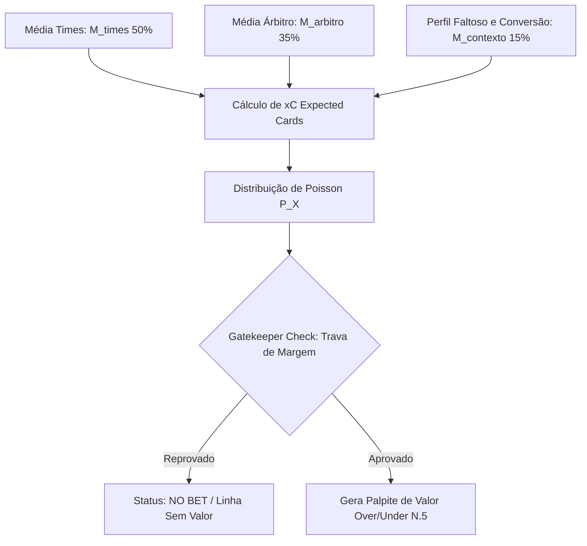

# Especificação Técnica: Sistema de Atribuição de Pesos e Predição de Cartões

## 1. Contexto e Problema Identificado

### O Caso de Estudo: Sarmiento Junín vs. Independiente Rivadavia
Em análises anteriores de partidas, observou-se uma contradição estatística na geração de palpites de cartões:
- **Árbitro:** P. Echavarria (Moderado, média de 4.33 amarelos/jogo).
- **Faltas:** Perfil com alto volume de faltas.
- **Palpite Gerado:** Over 4.5 Cartões (com 68.07% de probabilidade).
- **Indicador de Segurança:** Under 7.5 Cartões.
- **Média Combinada Real das Equipes:** 3.0 cartões por jogo.
- **Resultado:** A aposta no Over 4.5 foi perdida.

### Diagnóstico da Falha
1. **Falta de Ancoragem (Anchoring Bias):** O sistema superestimou a média do árbitro e o volume bruto de faltas, sem considerar a âncora primordial: **quanto as duas equipes juntas costumam receber de cartões**.
2. **Desconexão Faltas vs. Cartões:** Um alto volume de faltas não se traduz necessariamente em cartões se a taxa de conversão ($Cartões / Faltas$) das equipes for baixa ou se o árbitro aplicar advertências verbais (estilo permissivo/moderado em faltas táticas).
3. **Ausência de Trava de Margem (Margin Gatekeeper):** Recomendar Over 4.5 quando a expectativa matemática ($xC$) da partida está abaixo de 4.0 gera um falso positivo crítico.
4. **Dependência de Linhas Inexistentes:** Indicar "Under 7.5" como segurança é ineficaz para apostadores, pois linhas tão altas raramente estão disponíveis em casas de apostas convencionais.

---

## 2. Arquitetura da Solução Estatística

A nova arquitetura substitui inferências heurísticas simples por um modelo de **Expectativa Matemática Ponderada de Cartões ($xC$)** integrado a uma **Distribuição de Poisson** e **Travas de Segurança**.

---

## 3. Formulação Matemática

### 3.1. Expectativa Matemática de Cartões ($xC$)

$$xC = (w_{times} \times M_{times}) + (w_{arbitro} \times M_{arbitro}) + (w_{contexto} \times \Delta_{contexto})$$

Onde:
- **$M_{times}$ (50% de peso):** Média combinada de cartões (Média Mandante em casa + Média Visitante fora).
- **$M_{arbitro}$ (35% de peso):** Média histórica de cartões amarelos/vermelhos do árbitro na competição.
- **$\Delta_{contexto}$ (15% de peso):** Ajuste baseado na Taxa de Conversão $Cartões / Faltas$ e relevância do jogo (H2H, clássicos, rebaixamento).

#### Tabela de Pesos do Sistema:
| Métrica | Identificador | Peso ($w$) | Papel no Algoritmo |
| :--- | :--- | :---: | :--- |
| **Média Combinada dos Times** | `team_cards_combined` | **0.50** | **Âncora Principal:** Comportamento base real das equipes. |
| **Média do Árbitro** | `yellows_referee` | **0.35** | **Regulador:** Modula a tendência para cima ou para baixo. |
| **Conversão Faltas/Cartões** | `foul_conversion_factor` | **0.15** | **Ajuste Contextual:** Avalia a severidade real das faltas. |

---

### 3.2. Cálculo de Probabilidade Real via Distribuição de Poisson

Assumindo que eventos de cartões em uma partida de futebol seguem uma Distribuição de Poisson de parâmetro $\lambda = xC$:

A probabilidade de ocorrerem exatamente $k$ cartões é:

$$P(X = k) = \frac{e^{-xC} \cdot xC^k}{k!}$$

A probabilidade acumulada de ocorrer **Under $N.5$** (até $N$ cartões) é:

$$P(X \le N) = \sum_{k=0}^{N} \frac{e^{-xC} \cdot xC^k}{k!}$$

A probabilidade de ocorrer **Over $N.5$** (pelo menos $N+1$ cartões) é:

$$P(X \ge N+1) = 1 - P(X \le N)$$

---

## 4. Regras de Segurança e Trava (Gatekeepers)

### 4.1. Trava de Margem Mínima (Margin Gatekeeper)
Para recomendar um palpite no mercado **Over $N.5$**:
1. O valor esperado $xC$ deve satisfazer a condição de margem:
   $$xC \ge N.5 + 0.30$$
2. Se $xC < N.5 + 0.30$, qualquer recomendação de **Over $N.5$** fica **rigorosamente PROIBIDA**, devendo o sistema emitir o status `NO_BET` (Sem Aposta / Linha Desfavorável).

### 4.2. Trava de Taxa de Conversão ($Cartões / Faltas$)
- Calculamos a taxa de conversão das equipes:
  $$TC = \frac{\text{Média Amarelos}}{\text{Média Faltas}}$$
- Se $TC < 0.12$ (muitas faltas leves, pouca advertência), a contribuição do "perfil faltoso" é zerada ou reduzida a 0.0, evitando inflar falsamente a probabilidade de Over.

---

## 5. Exemplo Numérico Aplicado (Sarmiento vs. Ind. Rivadavia)

Dados de Entrada:
- $M_{times} = 3.00$
- $M_{arbitro} = 4.33$
- $M_{contexto} = 3.30$ (3.0 + 0.3 pelo volume de faltas)

**1. Cálculo do $xC$:**
$$xC = (0.50 \times 3.00) + (0.35 \times 4.33) + (0.15 \times 3.30)$$
$$xC = 1.500 + 1.5155 + 0.4950 = \mathbf{3.51 \text{ cartões}}$$

**2. Probabilidades Poisson ($\lambda = 3.51$):**
- $P(X \le 4) = P(0)+P(1)+P(2)+P(3)+P(4) = \mathbf{72.82\%}$ (Under 4.5)
- $P(X \ge 5) = 1 - 0.7282 = \mathbf{27.18\%}$ (Over 4.5)

**3. Validação do Gatekeeper para Over 4.5:**
- Condição necessária para Over 4.5: $xC \ge 4.80$.
- Resultado: $3.51 < 4.80 \rightarrow$ **REPROVADO**.
- **Resultado do Sistema:** Palpite ajustado para **Under 4.5** ou **NO BET / Entrada Não Recomendada para Over 4.5**.

---

## 6. Plano de Alterações no Código

### Arquivos Alvo:
1. `scripts/football_ingest_trends.py`
   - Atualizar a função de cálculo de expectativa e probabilidade.
   - Implementar matemática exata com `math.exp` e `math.factorial` para Poisson.
   - Aplicar a trava de segurança e ajustar as frases dinâmicas de predição.
2. `src/footballweb/app/Views/football/dashboard.php`
   - Atualizar a exibição das métricas de cartões no card para indicar $xC$ e alertas quando não houver aposta segura no Over.

---
*Documento criado para acompanhamento da implementação do Sistema de Pesos e Trava de Margem para Predição de Cartões.*
