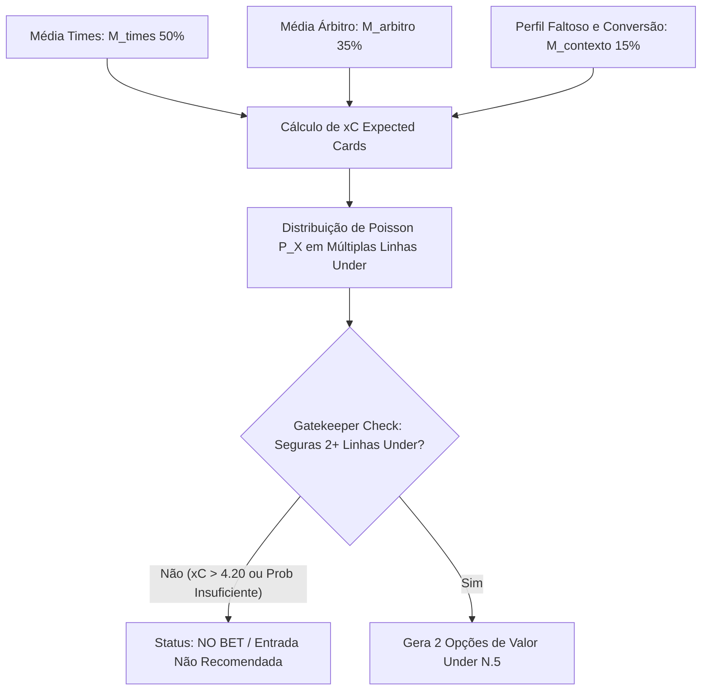

# Especificação Técnica: Sistema de Atribuição de Pesos e Predição de Cartões (Estratégia Exclusiva Under)

## 1. Contexto e Problema Identificado

### O Caso de Estudo: Sarmiento Junín vs. Independiente Rivadavia & Apostas em Linhas Altas
Em análises anteriores de partidas, observou-se uma contradição estatística e alto risco na geração de palpites de cartões:
- **Árbitro:** P. Echavarria (Moderado, média de 4.33 amarelos/jogo).
- **Faltas:** Perfil com alto volume de faltas.
- **Palpite Gerado Antigo:** Over 4.5 Cartões (com 68.07% de probabilidade).
- **Resultado Real:** O jogo teve baixíssimo volume de cartões (1 a 2 cartões), gerando RED nas apostas Over.

### Diagnóstico da Falha e Diretriz de Correção
1. **Risco Inerente de Entradas no Over:** Linhas de Over (ex: Over 3.5, Over 4.5) dependem de alta intensidade contínua do jogo e arbitragem rigorosa durante os 90 minutos. Qualquer oscilação gera Reds imediatos.
2. **Diretriz Absoluta:** O sistema **NUNCA mais recomendará apostas em Over de Cartões**.
3. **Obrigação Dupla Under:** O sistema deverá apresentar **pelo menos 2 opções de Under de cartões** (ex: `Under 5.5` e `Under 4.5`, ou `Under 6.5` e `Under 5.5`) validando a probabilidade de Poisson acumulada.
4. **Obrigação de NO_BET:** Caso o $xC$ seja elevado ou imprevisível (tornando linhas Under arriscadas), o sistema **deve obrigatoriamente emitir o sinal `NO_BET`** (Sem Aposta / Linha Desfavorável).

---

## 2. Arquitetura da Solução Estatística

A nova arquitetura combina a **Expectativa Matemática Ponderada de Cartões ($xC$)** com a **Distribuição de Poisson** e a **Trava de Segurança Exclusiva Under**.

---

## 3. Formulação Matemática

### 3.1. Expectativa Matemática de Cartões ($xC$)

$$xC = (w_{times} \times M_{times}) + (w_{arbitro} \times M_{arbitro}) + (w_{contexto} \times \Delta_{contexto})$$

Onde:
- **$M_{times}$ (50% de peso):** Média combinada de cartões (Média Mandante em casa + Média Visitante fora).
- **$M_{arbitro}$ (35% de peso):** Média histórica de cartões amarelos/vermelhos do árbitro na competição.
- **$\Delta_{contexto}$ (15% de peso):** Ajuste baseado na Taxa de Conversão $Cartões / Faltas$ e relevância do jogo.

#### Tabela de Pesos do Sistema:
| Métrica | Identificador | Peso ($w$) | Papel no Algoritmo |
| :--- | :--- | :---: | :--- |
| **Média Combinada dos Times** | `team_cards_combined` | **0.50** | **Âncora Principal:** Comportamento base real das equipes. |
| **Média do Árbitro** | `yellows_referee` | **0.35** | **Regulador:** Modula a tendência para cima ou para baixo. |
| **Conversão Faltas/Cartões** | `foul_conversion_factor` | **0.15** | **Ajuste Contextual:** Avalia a severidade real das faltas. |

---

### 3.2. Cálculo de Probabilidade Real via Distribuição de Poisson (Linhas Under)

Assumindo que eventos de cartões em uma partida de futebol seguem uma Distribuição de Poisson de parâmetro $\lambda = xC$:

A probabilidade acumulada de ocorrer **Under $N.5$** (até $N$ cartões) é:

$$P(X \le N) = \sum_{k=0}^{N} \frac{e^{-xC} \cdot xC^k}{k!}$$

As probabilidades para as linhas principais de Under são calculadas dinamicamente:
- $P(\text{Under 6.5}) = P(X \le 6)$
- $P(\text{Under 5.5}) = P(X \le 5)$
- $P(\text{Under 4.5}) = P(X \le 4)$
- $P(\text{Under 3.5}) = P(X \le 3)$

---

## 4. Regras de Segurança e Trava (Under Gatekeepers)

### 4.1. Regra de Sugestão Dupla Under
O sistema deve obrigatoriamente identificar **pelo menos 2 linhas de Under** com probabilidade de Poisson de alta confiança (ex: a principal com $\ge 75\%$ e a secundária com $\ge 60\%$).

Exemplo de saída recomendada:
- **Opção Principal:** Under 5.5 Cartões (Probabilidade: 86.4%)
- **Opção Secundária:** Under 4.5 Cartões (Probabilidade: 72.8%)

### 4.2. Trava de Emissão de `NO_BET`
- **Condição 1:** Se $xC > 4.20$ (expectativa de cartões alta, tornando qualquer linha de Under arriscada).
- **Condição 2:** Se a linha de Under 5.5 tiver probabilidade acumulada $< 75\%$.
- **Ação:** NENHUM palpite em Over será gerado. O sistema obrigatoriamente exibirá o status `NO_BET` (Sem Aposta Recomendada / Partida com Risco Elevado para Under).

---

## 5. Exemplo Numérico Aplicado (Sarmiento vs. Ind. Rivadavia)

Dados de Entrada:
- $M_{times} = 3.00$
- $M_{arbitro} = 4.33$
- $M_{contexto} = 3.30$

**1. Cálculo do $xC$:**
$$xC = (0.50 \times 3.00) + (0.35 \times 4.33) + (0.15 \times 3.30) = \mathbf{3.51 \text{ cartões}}$$

**2. Probabilidades Poisson ($\lambda = 3.51$):**
- $P(\text{Under 6.5}) = \mathbf{93.61\%}$
- $P(\text{Under 5.5}) = \mathbf{86.37\%}$
- $P(\text{Under 4.5}) = \mathbf{72.82\%}$

**3. Validação do Gatekeeper:**
- $xC = 3.51 \le 4.20 \rightarrow$ **APROVADO para Under**.
- **Dupla Sugestão Gerada:**
  1. 🛡️ **Linha Conservadora:** Under 5.5 Cartões (**86.37%**)
  2. 🎯 **Linha Principal:** Under 4.5 Cartões (**72.82%**)
- **Over 4.5 / Over 3.5:** PROIBIDO.

---

## 6. Alterações no Código

### Arquivo Alvo:
1. `scripts/football_ingest_trends.py`
   - Atualizar a função de avaliação de predição para calcular probabilidades acumuladas em Under 6.5, Under 5.5, Under 4.5 e Under 3.5.
   - Forçar recomendação dupla de Under ou emissão do aviso `NO_BET`.
   - Bloquear totalmente a geração de textos que sugiram apostar em "Over".

---
*Documento atualizado com a diretriz de Predição Exclusiva Under e Sinal NO_BET.*
