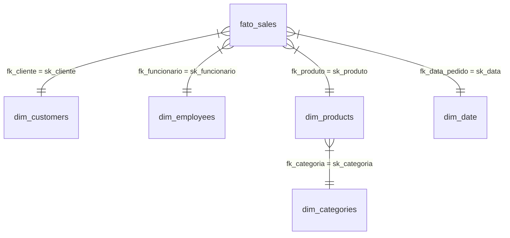

# Proposta de Modelagem Dimensional Star Schema (Northwind)

Este documento apresenta a especificação técnica para a modelagem do Star Schema de **Vendas (Sales)** a partir do banco de dados relacional OLTP Northwind. Toda a lógica de mapeamento, conversão e regras de negócio foi traduzida para os modelos do **dbt (Data Build Tool)** utilizando a sintaxe SQL combinada com macros Jinja, incluindo a geração de **Surrogate Keys (SK)** nativas e offline-compatible (sem dependência de pacotes externos como `dbt_utils`).

---

## 📐 Desenho Conceitual do Star Schema

Abaixo está a representação visual das relações entre a tabela Fato de Vendas e suas respectivas dimensões no modelo utilizando as **Surrogate Keys**:



---

## 🗺️ Mapeamento de Dados ("De-Para")

| Modelo de Destino | Tipo | Modelos de Origem (dbt Gold) | Geração da Surrogate Key (Nativa / Offline) | Descrição |
| :--- | :--- | :--- | :--- | :--- |
| **[fato_sales](file:///c:/Users/cblna/OneDrive/Documentos/datalake-air-flow-delta/dbt/projeto/proposta_star_schema_northwind.md#fato_sales)** | Fato | `gold_orders`, `gold_order_details` | `md5(coalesce(cast(od.order_id as varchar), '') \|\| '-' \|\| coalesce(cast(od.product_id as varchar), ''))` | Itens de pedidos, quantidades, valores e relacionamentos. |
| **[dim_customers](file:///c:/Users/cblna/OneDrive/Documentos/datalake-air-flow-delta/dbt/projeto/proposta_star_schema_northwind.md#dim_customers)** | Dimensão | `gold_customers` | `md5(coalesce(cast(customer_id as varchar), ''))` | Dados cadastrais e de localização dos clientes. |
| **[dim_employees](file:///c:/Users/cblna/OneDrive/Documentos/datalake-air-flow-delta/dbt/projeto/proposta_star_schema_northwind.md#dim_employees)** | Dimensão | `gold_employees` | `md5(coalesce(cast(employee_id as varchar), ''))` | Informações sobre a equipe de vendas. |
| **[dim_products](file:///c:/Users/cblna/OneDrive/Documentos/datalake-air-flow-delta/dbt/projeto/proposta_star_schema_northwind.md#dim_products)** | Dimensão | `gold_products` | `md5(coalesce(cast(product_id as varchar), ''))` | Catálogo de produtos com custos e preços sugeridos. |
| **[dim_categories](file:///c:/Users/cblna/OneDrive/Documentos/datalake-air-flow-delta/dbt/projeto/proposta_star_schema_northwind.md#dim_categories)** | Dimensão | `gold_categories` | `md5(coalesce(cast(category_id as varchar), ''))` | Lista distinta das categorias dos produtos. |
| **[dim_date](file:///c:/Users/cblna/OneDrive/Documentos/datalake-air-flow-delta/dbt/projeto/proposta_star_schema_northwind.md#dim_date)** | Dimensão | Gerador sintético dbt | `sk_data` (número no formato `YYYYMMDD`) | Dimensão de calendário para análise temporal. |

---

## 💻 Códigos dos Modelos dbt (Jinja + SQL)

<a id="dim_customers"></a>
### 👥 1. Dimensão Clientes (`dim_customers.sql`)

```sql
{{ config(materialized='table') }}

with source_customers as (
    select * from {{ ref('gold_customers') }}
)

select
    -- Geração da Surrogate Key nativa (sem pacotes)
    md5(coalesce(cast(customer_id as varchar), '')) as sk_cliente,
    customer_id as id_cliente,
    company_name as empresa,
    contact_name as nome_completo,
    contact_title as cargo,
    city as cidade,
    region as regiao,
    country as pais
from source_customers
```

---

<a id="dim_employees"></a>
### 👔 2. Dimensão Funcionários (`dim_employees.sql`)

```sql
{{ config(materialized='table') }}

with source_employees as (
    select * from {{ ref('gold_employees') }}
)

select
    -- Geração da Surrogate Key nativa baseada no employee_id real
    md5(coalesce(cast(employee_id as varchar), '')) as sk_funcionario,
    employee_id as id_funcionario,
    concat(first_name, ' ', last_name) as nome_completo,
    title as cargo,
    home_phone as telefone,
    city as cidade,
    country as pais
from source_employees
```

---

<a id="dim_categories"></a>
### 🏷️ 3. Dimensão Categorias (`dim_categories.sql`)

```sql
{{ config(materialized='table') }}

with source_categories as (
    select * from {{ ref('gold_categories') }}
)

select
    -- Geração da Surrogate Key nativa
    md5(coalesce(cast(category_id as varchar), '')) as sk_categoria,
    category_id as id_categoria,
    category_name as nome_categoria,
    description as descricao
from source_categories
```

---

<a id="dim_products"></a>
### 📦 4. Dimensão Produtos (`dim_products.sql`)

```sql
{{ config(materialized='table') }}

with source_products as (
    select * from {{ ref('gold_products') }}
),

categories as (
    select * from {{ ref('dim_categories') }}
)

select
    -- Geração da Surrogate Key do produto baseada no product_id
    md5(coalesce(cast(p.product_id as varchar), '')) as sk_produto,
    p.product_id as id_produto,
    p.product_name as nome_produto,
    p.unit_price as preco_venda,
    case when p.discontinued = 1 then 'Sim' else 'Não' end as descontinuado,
    c.sk_categoria as fk_categoria
from source_products p
left join categories c on p.category_id = c.id_categoria
```

---

<a id="dim_date"></a>
### 📅 5. Dimensão Data (`dim_date.sql`)

```sql
{{ config(materialized='table') }}

with date_series as (
    select 
        cast(range as date) as data_completa
    from range(
        cast('2000-01-01' as date), 
        cast('2030-12-31' as date), 
        interval '1 day'
    )
)

select
    -- Chave de data numérica
    cast(strftime(data_completa, '%Y%m%d') as integer) as sk_data,
    data_completa as data,
    year(data_completa) as ano,
    month(data_completa) as mes,
    day(data_completa) as dia,
    quarter(data_completa) as trimestre,
    dayofweek(data_completa) as dia_semana,
    strftime(data_completa, '%B') as nome_mes,
    case 
        when dayofweek(data_completa) in (0, 6) then 'Fim de Semana' 
        else 'Dia Útil' 
    end as tipo_dia
from date_series
```

---

<a id="fato_sales"></a>
### 📊 6. Tabela Fato Vendas (`fato_sales.sql`)

```sql
{{ config(materialized='table') }}

with orders as (
    select * from {{ ref('gold_orders') }}
),

order_details as (
    select * from {{ ref('gold_order_details') }}
)

select
    -- 1. Chave Primária da Fato nativa (composta do pedido + produto)
    md5(coalesce(cast(od.order_id as varchar), '') || '-' || coalesce(cast(od.product_id as varchar), '')) as sk_venda,
    
    -- 2. Chaves Estrangeiras nativas apontando para as SKs das Dimensões
    md5(coalesce(cast(o.customer_id as varchar), '')) as fk_cliente,
    md5(coalesce(cast(o.employee_id as varchar), '')) as fk_funcionario,
    md5(coalesce(cast(od.product_id as varchar), '')) as fk_produto,
    cast(strftime(o.order_date, '%Y%m%d') as integer) as fk_data_pedido,
    
    -- 3. Dimensões Degeneradas / Identificadores do Negócio (Rastreabilidade)
    od.order_id as id_pedido,
    od.product_id as id_produto,
    
    -- 4. Métricas e Valores do Item
    od.quantity as quantidade,
    od.unit_price as preco_unitario,
    od.discount as desconto,
    
    -- Valor total de frete do pedido
    cast(o.freight as double) as frete_total_pedido,
    
    -- Métricas Analíticas Calculadas
    (od.quantity * od.unit_price) as receita_bruta,
    (od.quantity * od.unit_price * (1 - od.discount)) as receita_liquida

from order_details od
inner join orders o on od.order_id = o.order_id
```

---

## 🧪 Validações de Qualidade e Integridade (`schema.yml`)

```yaml
version: 2

models:
  - name: dim_customers
    description: "Tabela dimensional de Clientes"
    columns:
      - name: sk_cliente
        tests:
          - unique
          - not_null

  - name: dim_employees
    description: "Tabela dimensional de Funcionários"
    columns:
      - name: sk_funcionario
        tests:
          - unique
          - not_null

  - name: dim_products
    description: "Catálogo de Produtos"
    columns:
      - name: sk_produto
        tests:
          - unique
          - not_null
      - name: fk_categoria
        tests:
          - not_null
          - relationships:
              to: ref('dim_categories')
              field: sk_categoria

  - name: dim_categories
    description: "Tabela dimensional normalizada de Categorias"
    columns:
      - name: sk_categoria
        tests:
          - unique
          - not_null

  - name: dim_date
    description: "Dimensão de Calendário"
    columns:
      - name: sk_data
        tests:
          - unique
          - not_null

  - name: fato_sales
    description: "Tabela fato consolidada das transações de Vendas (Sales)"
    columns:
      - name: sk_venda
        tests:
          - unique
          - not_null
      - name: fk_cliente
        tests:
          - relationships:
              to: ref('dim_customers')
              field: sk_cliente
      - name: fk_funcionario
        tests:
          - relationships:
              to: ref('dim_employees')
              field: sk_funcionario
      - name: fk_produto
        tests:
          - relationships:
              to: ref('dim_products')
              field: sk_produto
      - name: fk_data_pedido
        tests:
          - relationships:
              to: ref('dim_date')
              field: sk_data
```
