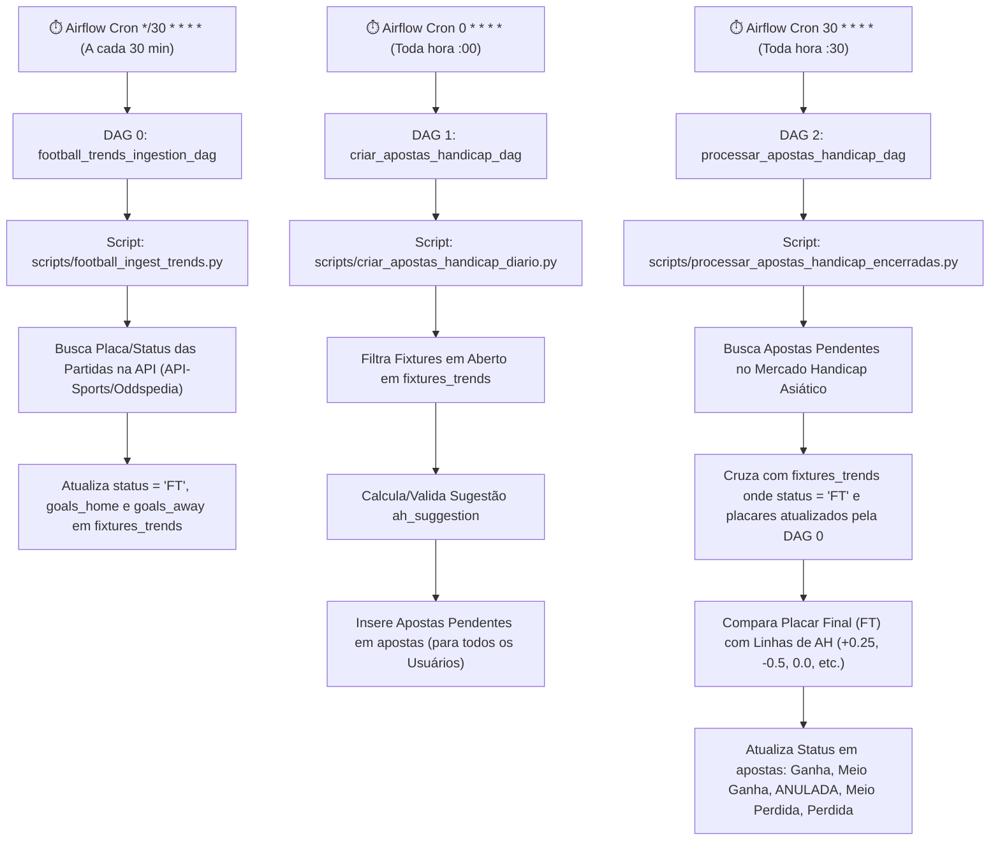

# 🚀 Documentação das DAGs de Handicap Asiático (FootballWeb)

Este documento fornece a documentação técnica e operacional completa das **DAGs do Apache Airflow** e scripts Python responsáveis pela automação do ciclo de vida das apostas no mercado de **Handicap Asiático (AH)** na plataforma **FootballWeb**.

O pipeline é composto por três rotinas automatizadas:
1. **Ingestão e Atualização Continuada de Partidas (`football_trends_ingestion_dag`)**: Atualiza a tabela `fixtures_trends` com placares finais (`goals_home`, `goals_away`) e status (`status = 'FT'`) vindos das APIs a cada 30 minutos.
2. **Geração/Criação Automática de Apostas em Jogos em Aberto (`criar_apostas_handicap_dag`)**: Registra apostas pendentes para jogos em aberto a cada hora.
3. **Auditoria e Liquidação de Apostas em Jogos Encerrados (`processar_apostas_handicap_dag`)**: Audita apostas pendentes cruzando com os placares finais atualizados e liquida os resultados a cada hora (no minuto `:30`).

---

## 🛠️ Arquitetura do Pipeline



---

## 0. 🔄 DAG 0: `football_trends_ingestion_dag` (Ingestão & Atualização de Resultados)

### 📋 Detalhes da DAG
- **Identificador DAG:** `football_trends_ingestion_dag`
- **Arquivo da DAG:** [`src/dags/football_trends_dag.py`](file:///root/datalake-air-flow-delta/src/dags/football_trends_dag.py)
- **Script Executado:** [`scripts/football_ingest_trends.py`](file:///root/datalake-air-flow-delta/scripts/football_ingest_trends.py)
- **Agendamento (`schedule_interval`):** `*/30 * * * *` (Execução a cada 30 minutos)
- **Operator:** `PythonOperator`
- **Owner:** `paulomnasc-558`

### ⚙️ Funcionamento Interno
1. **Consulta à API Externa (API-Sports / Oddspedia):**
   - Requisita os dados atualizados das partidas programadas para a data corrente e datas recentes.
2. **Atualização de Resultados Finais (FT) e Placares:**
   - Atualiza na tabela `fixtures_trends` as colunas de placar (`goals_home`, `goals_away`), cartões, escanteios, chutes, xG e o status oficial da partida (`status = 'FT'`).
3. **Sincronização de Jogos Encerrados Pendentes (`sync_past_finished_fixtures`):**
   - Executa varredura de partidas passadas ou em andamento que atingiram o tempo final, garantindo a atualização do status para `'FT'` e preenchimento dos gols.

---

## 1. 🟢 DAG 1: `criar_apostas_handicap_dag`

### 📋 Detalhes da DAG
- **Identificador DAG:** `criar_apostas_handicap_dag`
- **Arquivo da DAG:** [`src/dags/criar_apostas_handicap_dag.py`](file:///root/datalake-air-flow-delta/src/dags/criar_apostas_handicap_dag.py)
- **Script Executado:** [`scripts/criar_apostas_handicap_diario.py`](file:///root/datalake-air-flow-delta/scripts/criar_apostas_handicap_diario.py)
- **Agendamento (`schedule_interval`):** `0 * * * *` (Execução de hora em hora em `:00`)
- **Operator:** `PythonOperator`
- **Owner:** `paulomnasc-558`

### ⚙️ Funcionamento Interno
1. **Seleção de Partidas:**
   - Filtra as partidas em aberto da tabela `fixtures_trends` onde a data ajustada ao fuso horário do Brasil (-03:00) corresponde ao dia corrente ou dia seguinte (para antecipar partidas da madrugada/05h AM):
     ```sql
     SELECT * FROM fixtures_trends
     WHERE DATE(CONVERT_TZ(fixture_date, '+00:00', '-03:00')) IN (CURRENT_DATE(), DATE_ADD(CURRENT_DATE(), INTERVAL 1 DAY))
       AND status NOT IN ('PST', 'CANCELLED', 'POSTPONED')
     ORDER BY fixture_date ASC;
     ```
2. **Validação de Palpites:**
   - Analisa a coluna `ah_suggestion`.
   - Descarta palpites marcados como abstenção ou bloqueados por risco (*"Sem Entrada"*, *"Abstenção"*, *"APOSTA BLOQUEADA"*).
3. **Mapeamento de Odds:**
   - Identifica se o palpite favorece a equipe mandante ou visitante.
   - Atribui `odd_home` se for aposta no mandante ou `odd_away` se for aposta no visitante (odd padrão: 1.60 se nula).
4. **Persistência Multi-Usuário (Idempotente):**
   - Itera sobre todos os usuários cadastrados na tabela `usuario`.
   - Verifica se a aposta já foi criada para o par `(fixture_id, usuario_id, 'Handicap Asiático')` antes de inserir, evitando registros duplicados.
   - Insere na tabela `apostas` com `status = 'Pendente'`, `valor_aposta = 10.00` e `status_gatekeeper = 'APROVADO'`.

---

## 2. 🔴 DAG 2: `processar_apostas_handicap_dag`

### 📋 Detalhes da DAG
- **Identificador DAG:** `processar_apostas_handicap_dag`
- **Arquivo da DAG:** [`src/dags/processar_apostas_handicap_dag.py`](file:///root/datalake-air-flow-delta/src/dags/processar_apostas_handicap_dag.py)
- **Script Executado:** [`scripts/processar_apostas_handicap_encerradas.py`](file:///root/datalake-air-flow-delta/scripts/processar_apostas_handicap_encerradas.py)
- **Agendamento (`schedule_interval`):** `30 * * * *` (Execução de hora em hora em `:30`)
- **Operator:** `PythonOperator`
- **Owner:** `paulomnasc-558`

### ⚙️ Funcionamento Interno
1. **Seleção de Apostas Pendentes:**
   - Busca todas as apostas com `status = 'Pendente'` registradas no mercado de Handicap Asiático:
     ```sql
     SELECT a.* 
     FROM apostas a 
     WHERE a.status = 'Pendente'
       AND (a.mercado LIKE '%Handicap%' OR a.mercado IN ('Handicap Asiático', 'Empate Anula', 'DNB'));
     ```
2. **Cruzamento com Partidas Encerradas:**
   - Cruza a aposta com `fixtures_trends` buscando partidas com `status = 'FT'` (Full Time).
3. **Cálculo Matemático do Handicap Asiático:**
   - Extrai a linha de handicap (ex: `-0.25`, `0.0`, `+0.50`, `-1.00`).
   - Calcula a diferença de gols ajustada: $\Delta G = (\text{Gols Equipe Apostada} - \text{Gols Adversário}) + \text{Linha}$
   - **Tabela de Liquidação:**
     - $\Delta G > +0.25 \rightarrow$ **Ganha** (Retorno: $100\%$ do Lucro + Stake).
     - $\Delta G = +0.25 \rightarrow$ **Meio Ganha** (Retorno: $50\%$ do Lucro + Stake).
     - $\Delta G = 0.00 \rightarrow$ **ANULADA** (Retorno: $100\%$ Stake / Reembolso).
     - $\Delta G = -0.25 \rightarrow$ **Meio Perdida** (Retorno: $50\%$ Stake devolvida).
     - $\Delta G < -0.25 \rightarrow$ **Perdida** (Retorno: $0$).
4. **Atualização do Banco:**
   - Atualiza `status`, `resultado_detalhado`, `ganhos_potenciais` e `processado_em = NOW()` na tabela `apostas`.

---

## 🗄️ Estrutura de Dados das Tabelas Relacionadas

### Tabela `apostas`
| Campo | Tipo | Descrição |
| :--- | :--- | :--- |
| `id` | INT (PK) | Identificador único da aposta |
| `usuario_id` | INT (FK) | ID do usuário dono da aposta |
| `fixture_id` | INT | ID da partida correspondente em `fixtures_trends` |
| `time_casa` | VARCHAR(100) | Nome do time mandante |
| `time_fora` | VARCHAR(100) | Nome do time visitante |
| `mercado` | VARCHAR(100) | Mercado ('Handicap Asiático') |
| `palpite` | VARCHAR(100) | Linha sugerida (ex: 'Cruzeiro 0.0 (Empate Anula)') |
| `odd` | DECIMAL(5,2) | Odd da aposta |
| `valor_aposta` | DECIMAL(10,2) | Valor investido (padrão: R$ 10,00) |
| `ganhos_potenciais` | DECIMAL(10,2) | Retorno financeiro computado |
| `status` | ENUM | Status ('Pendente', 'Ganha', 'Meio Ganha', 'ANULADA', 'Meio Perdida', 'Perdida') |
| `resultado_detalhado` | TEXT | Log explicativo do placar e liquidação |

---

## 💻 Teste e Execução Manual via Terminal

Caso seja necessário disparar manualmente a criação ou liquidação de apostas sem aguardar o cron do Airflow, execute os comandos abaixo no terminal do projeto:

```bash
# Executar Criação Diária de Apostas em Jogos em Aberto
python3 /root/datalake-air-flow-delta/scripts/criar_apostas_handicap_diario.py

# Executar Liquidação Diária de Apostas de Jogos Encerrados
python3 /root/datalake-air-flow-delta/scripts/processar_apostas_handicap_encerradas.py
```
