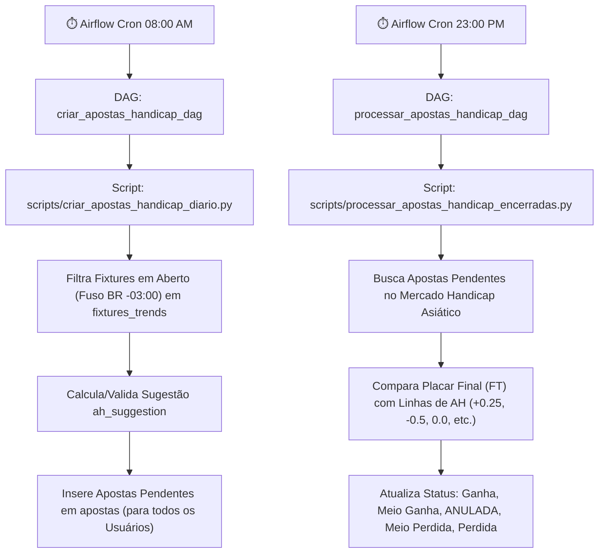

# 🚀 Documentação das DAGs de Handicap Asiático (FootballWeb)

Este documento fornece a documentação técnica e operacional completa das **DAGs do Apache Airflow** e scripts Python responsáveis pela automação do ciclo de vida das apostas no mercado de **Handicap Asiático (AH)** na plataforma **FootballWeb**.

O pipeline é composto por duas rotinas diárias:
1. **Geração/Criação Automática de Apostas em Jogos em Aberto (`criar_apostas_handicap_dag`)**
2. **Auditoria e Liquidação de Apostas em Jogos Encerrados (`processar_apostas_handicap_dag`)**

---

## 🛠️ Arquitetura do Pipeline



---

## 1. 🟢 DAG 1: `criar_apostas_handicap_dag`

### 📋 Detalhes da DAG
- **Identificador DAG:** `criar_apostas_handicap_dag`
- **Arquivo da DAG:** [`src/dags/criar_apostas_handicap_dag.py`](file:///root/datalake-air-flow-delta/src/dags/criar_apostas_handicap_dag.py)
- **Script Executado:** [`scripts/criar_apostas_handicap_diario.py`](file:///root/datalake-air-flow-delta/scripts/criar_apostas_handicap_diario.py)
- **Agendamento (`schedule_interval`):** `0 8 * * *` (Execução diária às 08:00 AM)
- **Operator:** `PythonOperator`
- **Owner:** `paulomnasc-558`

### ⚙️ Funcionamento Interno
1. **Seleção de Partidas:**
   - Filtra as partidas em aberto da tabela `fixtures_trends` onde a data ajustada ao fuso horário do Brasil (-03:00) corresponde à data atual:
     ```sql
     SELECT * FROM fixtures_trends
     WHERE DATE(CONVERT_TZ(fixture_date, '+00:00', '-03:00')) = CURRENT_DATE()
       AND status NOT IN ('FT', 'AET', 'PEN', 'PST', 'CANCELLED', 'POSTPONED')
     ORDER BY fixture_date ASC;
     ```
2. **Validação de Palpites:**
   - Analisa a coluna `ah_suggestion`.
   - Descarta palpites marcados como abstenção ou bloqueados por risco (*"Sem Entrada"*, *"Abstenção"*, *"APOSTA BLOQUEADA"*).
3. **Mapeamento de Odds:**
   - Identifica se o palpite favorece a equipe mandante ou visitante.
   - Atribui `odd_home` se for aposta no mandante ou `odd_away` se for aposta no visitante (odd padrão: 1.90 se nula).
4. **Persistência Multi-Usuário (Idempotente):**
   - Itera sobre todos os usuários cadastrados na tabela `usuario`.
   - Verifica se a aposta já foi criada para o par `(fixture_id, usuario_id, 'Handicap Asiático')` antes de inserir, evitando registros duplicados.
   - Insere na tabela `apostas` com `status = 'Pendente'`, `valor_aposta = 10.00` e `status_gatekeeper = 'APROVADO'`.

---

## 2. 🔴 DAG 2: `processar_apostas_handicap_dag`

### 📋 Detalhes da DAG
- **Identificador DAG:** `processar_apostas_handicap_dag`
- **Arquivo da DAG:** [`src/dags/processar_apostas_handicap_dag.py`](file:///root/datalake-air-flow-delta/src/dags/processar_apostas_handicap_dag.py)
- **Script Executado:** [`scripts/processar_apostas_handicap_encerradas.py`](file:///root/datalake-air-flow-delta/scripts/processar_apostas_handicap_encerradas.py)
- **Agendamento (`schedule_interval`):** `0 23 * * *` (Execução diária às 23:00 hs)
- **Operator:** `PythonOperator`
- **Owner:** `paulomnasc-558`

### ⚙️ Funcionamento Interno
1. **Seleção de Apostas Pendentes:**
   - Busca todas as apostas com `status = 'Pendente'` registradas no mercado de Handicap Asiático:
     ```sql
     SELECT a.* 
     FROM apostas a 
     WHERE a.status = 'Pendente'
       AND (a.mercado LIKE '%Handicap%' OR a.mercado IN ('Handicap Asiático', 'Empate Anula', 'DNB'));
     ```
2. **Cruzamento com Partidas Encerradas:**
   - Cruza a aposta com `fixtures_trends` buscando partidas com `status = 'FT'` (Full Time).
3. **Cálculo Matemático do Handicap Asiático:**
   - Extrai a linha de handicap (ex: `-0.25`, `0.0`, `+0.50`, `-1.00`).
   - Calcula a diferença de gols ajustada: $\Delta G = (\text{Gols Equipe Apostada} - \text{Gols Adversário}) + \text{Linha}$
   - **Tabela de Liquidação:**
     - $\Delta G > +0.25 \rightarrow$ **Ganha** (Retorno: $100\%$ do Lucro + Stake).
     - $\Delta G = +0.25 \rightarrow$ **Meio Ganha** (Retorno: $50\%$ do Lucro + Stake).
     - $\Delta G = 0.00 \rightarrow$ **ANULADA** (Retorno: $100\%$ Stake / Reembolso).
     - $\Delta G = -0.25 \rightarrow$ **Meio Perdida** (Retorno: $50\%$ Stake devolvida).
     - $\Delta G < -0.25 \rightarrow$ **Perdida** (Retorno: $0$).
4. **Atualização do Banco:**
   - Atualiza `status`, `resultado_detalhado`, `ganhos_potenciais` e `processado_em = NOW()` na tabela `apostas`.

---

## 🗄️ Estrutura de Dados das Tabelas Relacionadas

### Tabela `apostas`
| Campo | Tipo | Descrição |
| :--- | :--- | :--- |
| `id` | INT (PK) | Identificador único da aposta |
| `usuario_id` | INT (FK) | ID do usuário dono da aposta |
| `fixture_id` | INT | ID da partida correspondente em `fixtures_trends` |
| `time_casa` | VARCHAR(100) | Nome do time mandante |
| `time_fora` | VARCHAR(100) | Nome do time visitante |
| `mercado` | VARCHAR(100) | Mercado ('Handicap Asiático') |
| `palpite` | VARCHAR(100) | Linha sugerida (ex: 'Cruzeiro 0.0 (Empate Anula)') |
| `odd` | DECIMAL(5,2) | Odd da aposta |
| `valor_aposta` | DECIMAL(10,2) | Valor investido (padrão: R$ 10,00) |
| `ganhos_potenciais` | DECIMAL(10,2) | Retorno financeiro computado |
| `status` | ENUM | Status ('Pendente', 'Ganha', 'Meio Ganha', 'ANULADA', 'Meio Perdida', 'Perdida') |
| `resultado_detalhado` | TEXT | Log explicativo do placar e liquidação |

---

## 💻 Teste e Execução Manual via Terminal

Caso seja necessário disparar manualmente a criação ou liquidação de apostas sem aguardar o cron do Airflow, execute os comandos abaixo no terminal do projeto:

```bash
# Executar Criação Diária de Apostas em Jogos em Aberto
python3 /root/datalake-air-flow-delta/scripts/criar_apostas_handicap_diario.py

# Executar Liquidação Diária de Apostas de Jogos Encerrados
python3 /root/datalake-air-flow-delta/scripts/processar_apostas_handicap_encerradas.py
```
