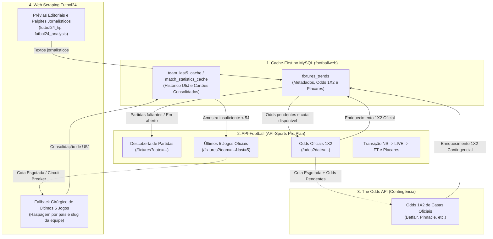

# 📡 Fluxo de Obtenção de Dados: API-Football, The Odds API e Futbol24

Este documento descreve detalhadamente o fluxo de obtenção e enriquecimento de dados executado pelo script [`scripts/football_ingest_trends.py`](file:///root/datalake-air-flow-delta/scripts/football_ingest_trends.py), detalhando as responsabilidades, a hierarquia de contingência e as regras de negócio de cada fonte externa.

---

## 🗺️ 1. Diagrama Arquitetural em Camadas



---

## 🏛️ 2. Detalhamento por Provedor

### A. API-Football (`v3.football.api-sports.io`) — Fonte Primária Oficial
É o provedor principal e oficial do ecossistema, operando sob o plano Pro:

1. **Descoberta de Partidas (`fetch_fixtures_by_date`)**:
   - Varre as partidas em uma janela de 3 dias (`ontem`, `hoje` e `amanhã`).
   - Aplica o catálogo de ligas permitidas (`ALLOWED_LEAGUES`), filtrando automaticamente partidas femininas e categorias de base.
   - Realiza o upsert em `fixtures_trends` registrando IDs das equipes, estádio, liga, rodada e árbitro.
2. **Ciclo de Vida de Partidas Abertas (`sync_pending_past_fixtures`)**:
   - Identifica confrontos no banco com status transitório (`NS`, `1H`, `2H`, `HT`, `LIVE`).
   - Consulta a API para registrar a transição para `FT` (encerrado) e salvar os gols definitivos (`goals_home`, `goals_away`).
3. **Odds Pré-Jogo Oficiais (`fetch_api_sports_odds_by_date`)**:
   - Consulta o endpoint paginado `/odds?date=YYYY-MM-DD` com cache em memória por data.
   - Mapeia cotações 1X2 de casas de referência (Betano, Bet365, Pinnacle).
4. **Forma Recente dos Times (`fetch_team_last5_form`)**:
   - Se o banco MySQL local possuir menos de 5 partidas registradas para o time, consulta `/fixtures?team={team_id}&last=5`.
   - **Circuit-Breaker de Cota**: Caso a cota diária de requisições seja atingida (`Rate limit atingido / requests: limit for the day`), ativa uma flag em memória que cessa imediatamente novas requisições externas à API-Sports nesta execução, protegendo a conta.

---

### B. The Odds API — Contingência Estrita de Odds 1X2
Opera estritamente sob demanda emergencial (em conformidade com a **Regra 3, item 5 de `AGENTS.md`**):

- **Critério Mandatório de Execução**:
  ```python
  is_api_quota_exceeded = _api_sports_quota_exceeded or _api_sports_odds_rate_limited
  should_run_fallback = is_api_quota_exceeded and (missing_count > 0)
  ```
  A The Odds API só é acionada se a API-Sports estiver **sem cota disponível** E existirem jogos do dia **sem nenhuma odd cadastrada**.
- **Escopo**:
  - Obtém cotações 1X2 de casas internacionais oficiais para evitar que os cards fiquem desprovidos de mercado no dashboard.
- **Proibição de Arbitragem**:
  - A triangulação de Surebets está permanentemente desativada. As flags de banco são sempre gravadas como `is_surebet = 0` e `surebet_profit_pct = 0.0`.

---

### C. Web Scraping no Futbol24 — Prévias e Fallback de Últimos 5 Jogos
O Futbol24 atua em dois fluxos complementares:

#### 1. Prévias e Análises Jornalísticas (`scrape_futbol24_previews`)
- Raspa as dicas e resenhas pré-jogo publicadas na seção de palpites do Futbol24.
- Salva no banco os campos:
  - `futbol24_tip`: Palpite jornalístico (ex: vitória mandante, ambas marcam).
  - `futbol24_analysis`: Texto editorial com a justificativa do confronto.
  - `futbol24_url`: Link direto da prévia no Futbol24.

#### 2. Fallback Cirúrgico de Últimos 5 Jogos (`scrape_futbol24_team_last5`)
Utilizado como o 4º nível na esteira de obtenção da forma recente de uma equipe:
1. Nível 1: Consulta SQL por ID estrito em `fixtures_trends` (`FT`);
2. Nível 2: Herança segura de `U5J_DATA` de confrontos dos últimos 10 dias;
3. Nível 3: Cache persistente `team_last5_cache` (TTL 24h);
4. Nível 4 (Fallback): Se a API-Sports estiver sem cota e a amostra for `< 5` jogos, aciona o scraper do Futbol24.

**Regras Mandatórias do Scraper Futbol24**:
- **Respeito Estrito ao País de Origem**: Utiliza o dicionário `league_to_country` mapeado em `football_ingest_trends.py` para buscar o clube exclusivamente na pasta canônica do seu país (ex: `https://www.futbol24.com/pt/equipa/Italy/Sassuolo-Calcio/`).
- **Proibição de Fallback Cego**: É terminantemente proibido redirecionar buscas com falha para a pasta `/Brazil/`. Se a página do clube não for encontrada, o scraper retorna `None` silenciosamente, sem disparar requisições 404 indevidas.

---

## ⚖️ 3. Separação Arquitetural: Ingestão Geral vs. Criação de Apostas (MR #102)

O sistema mantém duas camadas com critérios de filtragem intencionalmente distintos:

| Camada | Arquivos Responsáveis | Filtro de Ligas | Propósito |
| :--- | :--- | :--- | :--- |
| **Ingestão Geral & DataLake** | `scripts/football_ingest_trends.py` | `ALLOWED_LEAGUES` (Amplo: > 60 ligas, 1ª e 2ª divisões) | Manter histórico completo de confrontos, vitrine aberta de jogos e séries temporais no banco MySQL. |
| **Simulação & Criação de Apostas** | `scripts/criar_apostas_handicap_diario.py`<br>`scripts/criar_apostas_cartoes_diario.py` | `ALLOWED_LEAGUE_IDS` / `is_allowed_league()` (Estrito: Elite e Continentais) | Blindar a banca e as simulações, operando exclusivamente em competições de alta liquidez e confiabilidade. |
