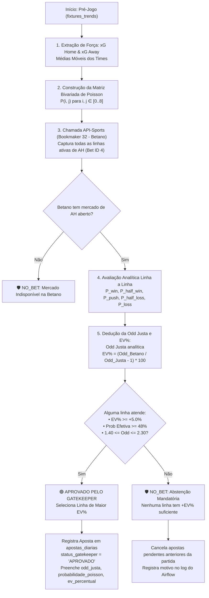

# ⚽ Documentação Técnica: Processo de Criação de Palpites de Handicap Asiático (AH)

Esta documentação detalha a arquitetura, formulação matemática, regras estatísticas e ciclo operacional empregados na geração, validação e recomendação de palpites e apostas no mercado de **Handicap Asiático (Asian Handicap - AH)** na plataforma **FootballWeb**.

---

## 1. Visão Geral e Princípios Fundamentais

Historicamente, muitos sistemas de apostas operavam baseando-se em regras puramente heurísticas (por exemplo, "se a diferença de gols esperados for maior que 0.5, sugere -0.5"). No entanto, apostar em linhas fixas sem avaliar a cotação real da casa gera expectativa matemática negativa no longo prazo.

Para blindar a banca e espelhar a mesma disciplina matemática consagrada no mercado de Cartões, o processo de criação de palpites de Handicap Asiático adota quatro princípios inegociáveis:

1. **Modelagem Bivariada de Poisson**: Não se assume um resultado fixo; calcula-se a distribuição conjunta de probabilidade para todos os placares prováveis ($0 \times 0$ até $8 \times 8$).
2. **Varredura Completa de Linhas da Betano (Bookmaker ID 32)**: O sistema consulta via API todas as linhas ativas oferecidas pela Betano para o confronto (Bet ID 4: Asian Handicap), em vez de impor uma linha arbitrária.
3. **Dedução Analítica da Odd Justa (*Fair Odd*)**: Cada linha é precificada probabilisticamente, ponderando com precisão os cenários de *Green*, *Meio-Green*, *Push/Anulada*, *Meio-Red* e *Red*.
4. **Gatekeeper com Abstenção Mandatória (`NO_BET`)**: O sistema só recomenda ou cria aposta se a cotação oferecida pela Betano possuir **Valor Esperado Positivo real ($+EV\% \ge 5.0\%$)** e probabilidade de cobertura $\ge 48\%$. Se nenhuma linha da Betano apresentar margem matemática lucrativa, o sistema declara `NO_BET` e não arrisca a banca.

---

## 2. Fluxograma Operacional do Pipeline

---

## 3. Formulação Matemática

### 3.1. Matriz Bivariada de Poisson (Expectativa de Gols)

A probabilidade conjunta de a equipe mandante marcar $i$ gols e a visitante marcar $j$ gols é calculada pelo produto das distribuições de Poisson independentes calibradas pelas expectativas de gols ($\lambda_{\text{home}} = xG_{\text{home}}$ e $\lambda_{\text{away}} = xG_{\text{away}}$):

$$P(G_{\text{home}} = i, G_{\text{away}} = j) = \frac{e^{-\lambda_{\text{home}}} \lambda_{\text{home}}^i}{i!} \times \frac{e^{-\lambda_{\text{away}}} \lambda_{\text{away}}^j}{j!}$$

A matriz é calculada para $i \in [0, 8]$ e $j \in [0, 8]$, cobrindo mais de $99,8\%$ da massa de probabilidade de qualquer partida de futebol.

---

### 3.2. Classificação dos Desfechos do Handicap Asiático

Para cada linha asiática $L$ avaliada (ex: $-0.25$, $-0.50$, $0.0$, $+0.25$, etc.) aplicada à equipe selecionada, define-se a diferença de gols ajustada para cada placar $(i, j)$:

$$\text{Ajuste} = (G_{\text{equipe}} - G_{\text{adversário}}) + L$$

Cada célula da matriz de Poisson tem sua probabilidade somada a um dos 5 compartimentos de desfecho:

| Diferença Ajustada ($\text{Ajuste}$) | Desfecho | Payoff Financeiro (Stake = $S$, Odd = $O$) | Probabilidade Acumulada |
| :--- | :--- | :--- | :--- |
| $\text{Ajuste} \ge +0.50$ | **Vitória Plena (Green)** | $+ (O - 1) \times S$ | $P_{\text{win}}$ |
| $\text{Ajuste} = +0.25$ | **Meio-Ganho (Half Win)** | $+ \frac{O - 1}{2} \times S$ | $P_{\text{half\_win}}$ |
| $\text{Ajuste} = 0.00$ | **Anulada / Devolvida (Push)** | $0$ (Stake devolvida integralmente) | $P_{\text{push}}$ |
| $\text{Ajuste} = -0.25$ | **Meio-Perda (Half Loss)** | $- 0.5 \times S$ (Metade da stake perdida) | $P_{\text{half\_loss}}$ |
| $\text{Ajuste} \le -0.50$ | **Derrota Plena (Red)** | $- 1.0 \times S$ (Stake perdida integralmente) | $P_{\text{loss}}$ |

---

### 3.3. Dedução Exata da Odd Justa (*Fair Odd*)

A **Odd Justa** ($O_{\text{justa}}$) é a cotação exata em que o Valor Esperado ($\mathbb{E}$) é nulo ($\mathbb{E}[\text{Payoff}] = 0$):

$$\mathbb{E}[\text{Payoff}] = P_{\text{win}} \cdot (O - 1) + P_{\text{half\_win}} \cdot \frac{O - 1}{2} + P_{\text{push}} \cdot 0 - P_{\text{half\_loss}} \cdot 0.5 - P_{\text{loss}} \cdot 1 = 0$$

Sabendo que a soma total das probabilidades é unitária ($P_{\text{win}} + P_{\text{half\_win}} + P_{\text{push}} + P_{\text{half\_loss}} + P_{\text{loss}} = 1.0$), substituímos $P_{\text{loss}}$:

$$P_{\text{loss}} = 1.0 - P_{\text{win}} - P_{\text{half\_win}} - P_{\text{push}} - P_{\text{half\_loss}}$$

Substituindo e isolando $O_{\text{justa}}$, chegamos à equação canônica fechada:

$$O_{\text{justa}} = \frac{1.0 - \left(\frac{P_{\text{half\_win}}}{2} + P_{\text{push}} + 0.5 \times P_{\text{half\_loss}}\right)}{P_{\text{win}} + \frac{P_{\text{half\_win}}}{2}}$$

---

### 3.4. Probabilidade Efetiva e Valor Esperado ($+EV\%$)

Com a Odd Justa analítica calculada:

1. **Probabilidade Efetiva de Cobertura ($P_{\text{eff}}$)**:
   $$P_{\text{eff}} = \frac{100.0}{O_{\text{justa}}}$$

2. **Valor Esperado Percentual ($+EV\%$) contra a Odd Real da Betano ($O_{\text{betano}}$)**:
   $$+EV\% = \left(\frac{O_{\text{betano}}}{O_{\text{justa}}} - 1.0\right) \times 100$$

---

## 4. Consulta e Varredura da Matriz de Linhas Betano

### 4.1. Por que consultar todas as linhas da Betano?
No mercado de Handicap Asiático, as casas de apostas abrem múltiplas linhas secundárias com diferentes equilíbrios de risco/retorno para o mesmo jogo:
* Exemplo: `Mandante -0.75` @ 2.10, `Mandante -0.50` @ 1.82, `Mandante -0.25` @ 1.58, `Mandante 0.0` @ 1.35.

O script [`scripts/criar_apostas_handicap_diario.py`](file:///root/datalake-air-flow-delta/scripts/criar_apostas_handicap_diario.py) executa a função `fetch_all_betano_ah_lines(fixture_id)`:
1. Requisita o endpoint `/odds?fixture={id}&bookmaker=32` da API-Sports.
2. Filtra especificamente as apostas com `id: 4` (*Asian Handicap*).
3. Normaliza todas as linhas (ex: `Home -0.5`, `Away +0.25`, etc.) e extrai suas cotações ativas.

### 4.2. Algoritmo de Seleção da Melhor Linha (Janela Anti-Empate)
Para blindar a banca contra empates tardios aos 90 minutos (como ocorria com `-0.25` resultando em meio-red ou `-0.50` em red integral), o sistema restringe a seleção **estritamente às linhas onde o empate garante reembolso ou vitória**:
* **Janela Permitida**: `{0.0 (DNB), +0.50, +0.75, +1.00, +1.25, +1.50}`.
* **Linhas Negativas Banidas**: Linhas como `-0.25`, `-0.50`, `-0.75`, `-1.00` são proibidas pelo Gatekeeper.

Para cada linha capturada da Betano:
1. O modelo valida se a linha pertence estritamente à janela permitida.
2. Descarta imediatamente linhas fora da faixa de segurança ($O_{\text{betano}} < 1.30$ ou $O_{\text{betano}} > 2.35$).
3. Valida a coerência do favoritismo: o time favorito no 1X2 só pode concorrer à linha `0.0 (DNB)`. Linhas de cobertura positiva são reservadas ao azarão ou confrontos equilibrados.
4. O modelo avalia a linha contra a matriz de Poisson da partida e deduz a Odd Justa e o $+EV\%$.
5. Descarta linhas com probabilidade efetiva baixa ($P_{\text{eff}} < 48.0\%$).
6. Dentre as linhas que satisfazem $+EV\% \ge 5.0\%$, seleciona a linha que maximiza o retorno ajustado ao risco ($EV\% \times \frac{P_{\text{eff}}}{100}$). Se nenhuma linha for aprovada, declara `NO_BET` e não cria aposta.

---

## 5. Política de Abstenção Mandatória (`NO_BET`)

Se a Betano precificar todas as linhas com margens pesadas (vig alto) de modo que nenhuma linha alcance $+EV\% \ge +5.0\%$, o pipeline adota a conduta de **Abstenção Mandatória**:

* **Nenhuma aposta é criada** para o jogo.
* Se já existia uma aposta preliminar registrada em estado `Pendente`, o sistema atualiza seu status para `CANCELADA_GATEKEEPER`, evitando que ela permaneça aberta.
* Um log detalhado com a tag `🛡️ [Gatekeeper NO_BET]` é gravado no console do Apache Airflow.

### Exemplo Real de Proteção (07/09/2026)
* **Confronto**: Barracas Central vs Argentinos JRS
* **Linha Antiga (Heurística sem Poisson)**: Argentinos JRS -0.25 @ Odd 1.31
* **Resultado Real**: 0 a 0 (Meio-Red / Prejuízo de banca)
* **Avaliação pelo Novo Gatekeeper de Poisson**:
  * Odd Justa Analítica: `1.286`
  * Odd Real Betano: `1.310`
  * $+EV\%$ Calculado: `+1.87%`
  * **Decisão do Gatekeeper**: **`NO_BET` (Reprovado: $EV < 5.0\%$)**
* **Benefício**: A banca não teria realizado essa entrada, eliminando o prejuízo ocorrido.

---

## 6. Persistência de Dados e Auditoria

Todas as métricas analíticas calculadas são persistidas nas tabelas do banco de dados MySQL para permitir auditoria total e rastreabilidade:

### Tabela `apostas` / `apostas_diarias`
* `odd_justa` (`DECIMAL(5,2)`): Odd calculada matematicamente pela distribuição bivariada de Poisson.
* `probabilidade_poisson` (`DECIMAL(5,2)`): Probabilidade efetiva de cobertura da linha ($P_{\text{eff}} = \frac{100}{O_{\text{justa}}}$).
* `ev_percentual` (`DECIMAL(5,2)`): Margem de valor esperado da aposta frente à Betano.
* `status_gatekeeper` (`VARCHAR(30)`): `'APROVADO'` ou `'NO_BET'`.
* `criterios_atendidos` (`TEXT`): Resumo técnico dos critérios (ex: `Odd Real: 1.85 | Odd Justa: 1.62 | EV: +14.2% | Prob: 61.7%`).

### Tabela `fixtures_trends`
* `ah_pick` (`VARCHAR(100)`): Sugestão da linha (ex: `Flamengo -0.5 AH`). Nulo caso seja `NO_BET`.
* `ah_fair_odd` (`DECIMAL(5,2)`): Odd justa calculada.
* `ah_ev_percent` (`DECIMAL(5,2)`): $+EV\%$ estimado.
* `ah_reasoning` (`TEXT`): Memória de cálculo completa registrando os $\lambda$ de ataque/defesa, matriz e justificativa estatística.

---

## 7. Scripts e DAGs Relacionadas

| Componente | Caminho | Função |
| :--- | :--- | :--- |
| **DAG de Criação** | [`src/dags/criar_apostas_handicap_dag.py`](file:///root/datalake-air-flow-delta/src/dags/criar_apostas_handicap_dag.py) | Orquestra a execução da criação horária de apostas de AH. |
| **Script de Criação** | [`scripts/criar_apostas_handicap_diario.py`](file:///root/datalake-air-flow-delta/scripts/criar_apostas_handicap_diario.py) | Realiza a varredura da API Betano, cálculo da matriz e cadastro das apostas aprovadas. |
| **Script de Ingestão** | [`scripts/football_ingest_trends.py`](file:///root/datalake-air-flow-delta/scripts/football_ingest_trends.py) | Atualiza tendências, xG e calcula sugestão preliminar de AH em `fixtures_trends`. |
| **DAG de Liquidação** | [`src/dags/processar_apostas_handicap_dag.py`](file:///root/datalake-air-flow-delta/src/dags/processar_apostas_handicap_dag.py) | Audita e liquida apostas de jogos finalizados (`FT`). |
| **Script de Liquidação** | [`scripts/processar_apostas_handicap_encerradas.py`](file:///root/datalake-air-flow-delta/scripts/processar_apostas_handicap_encerradas.py) | Avalia o placar final e liquida em: Ganha, Meio-Ganha, Anulada, Meio-Perdida ou Perdida. |
| **Controller Web** | [`src/footballweb/app/Controllers/ApostaController.php`](file:///root/datalake-air-flow-delta/src/footballweb/app/Controllers/ApostaController.php) | Gatekeeper em tempo real para visualização e criação manual de apostas no dashboard. |
| **View de Perdas** | [`src/footballweb/app/Views/apostas/relatorio_ia_perdas.php`](file:///root/datalake-air-flow-delta/src/footballweb/app/Views/apostas/relatorio_ia_perdas.php) | Dashboard de auditoria pós-jogo com métricas do Gatekeeper e placar real. |
