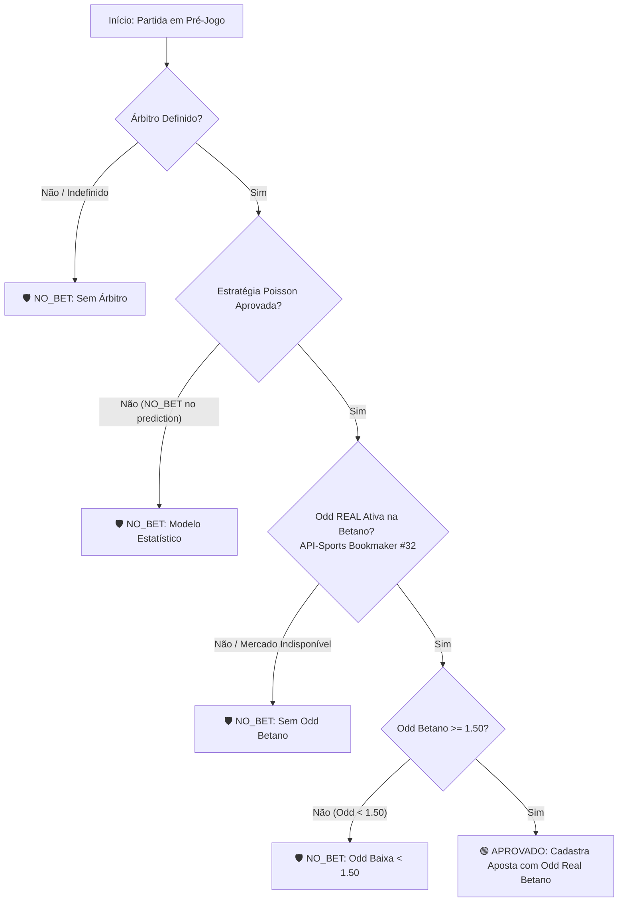

# Documentação Técnica: Regras de Validação e Automação de Apostas em Cartões (Betano & Airflow)

## 1. Visão Geral

Esta documentação especifica as regras operacionais, estatísticas e financeiras aplicadas pelo pipeline automatizado em [`scripts/criar_apostas_cartoes_diario.py`](file:///root/datalake-air-flow-delta/scripts/criar_apostas_cartoes_diario.py) e acionado pela DAG do Airflow [`src/dags/criar_apostas_cartoes_dag.py`](file:///root/datalake-air-flow-delta/src/dags/criar_apostas_cartoes_dag.py).

O objetivo principal desta arquitetura é **eliminar falsas expectativas de lucro** causadas por odds sintéticas/estimadas e garantir que apostas em cartões só sejam geradas se existirem **odds REAIS ativas à venda na Betano** com um perfil de risco/recompensa aceitável.

---

## 2. Fluxo de Validação do Gatekeeper (*Triplo Filtro de Segurança*)

Antes de cadastrar qualquer aposta na tabela `apostas`, a partida deve ser aprovada sequencialmente por todos os filtros abaixo:



---

## 3. Detalhamento das Regras

### 3.1. Consulta Obrigatória de Odds Reais da Betano (Bookmaker ID 32)
* **Objetivo:** Garantir que o sistema só recomende apostas que o usuário realmente consegue fazer no site/app da Betano.
* **Mecanismo:** A função `fetch_betano_real_card_odds(fixture_id, palpite_str, line_val)` realiza chamada à API-Sports (`https://v3.football.api-sports.io/odds?fixture={fixture_id}&bookmaker=32`).
* **Mercados Inspecionados:** *Bet #80 (Cards Over/Under)*, *Bet #82 (Home Team Total Cards)*, *Bet #83 (Away Team Total Cards)*, *Yellow Cards*.
* **Comportamento:**
  * Se a Betano **possuir a cotação real** para a linha sugerida (ex: `Under 4.5` @ 1.75), a odd real é capturada.
  * Se a Betano **não abriu o mercado de cartões** para o jogo, a entrada é **CANCELADA** (`NO_BET_SEM_ODD_BETANO`).

### 3.2. Trava de Odd Mínima (`Odd Baixa < 1.50`)
* **Objetivo:** Proteger a banca contra apostas de baixo retorno e alto risco relativo.
* **Justificativa Financeira:**
  * Uma odd de **1.18** oferece apenas **18% de retorno** (R$ 1,80 de lucro para R$ 10,00 apostados).
  * Para essa aposta se pagar no longo prazo (*break-even*), exige uma taxa de acerto de **84,7%** ($\frac{1}{1.18} = 84,7\%$).
  * Como partidas de futebol estão sujeitas a eventos imprevisíveis (expulsões, desentendimentos no final), arriscar 100% da stake por 18% de retorno gera um valor esperado ruim no longo prazo.
* **Regra:** Cotações inferiores a **1.50** são descartadas automaticamente.

---

## 4. Padrão de Logs no Console do Airflow

A DAG [`src/dags/criar_apostas_cartoes_dag.py`](file:///root/datalake-air-flow-delta/src/dags/criar_apostas_cartoes_dag.py) captura a saída padrão (`STDOUT`) do script e exibe no console do Airflow. Os logs seguem o seguinte padrão:

| Log Impresso no Console Airflow | Significado | Ação Tomada |
| :--- | :--- | :--- |
| `🛡️ [Gatekeeper NO_BET / Sem Odd Betano] Partida X vs Y -> Mercado 'Menos de N.5 Cartões' indisponível/não à venda na Betano.` | A Betano não abriu mercado de cartões para esta partida na API. | **Ignorada / Abstenção** |
| `🛡️ [Odd Baixa < 1.50] Partida X vs Y -> Odd Betano (1.18) é inferior ao mínimo permitido (1.50).` | A Betano tem a odd, porém a cotação é menor que 1.50. | **Ignorada / Abstenção** |
| `🛡️ [Gatekeeper NO_BET / Sem Árbitro] Partida X vs Y -> Árbitro não definido.` | Partida sem arbitragem oficial confirmada. | **Ignorada / Abstenção** |
| `🟢 [Aposta Cartões Criada User #558] ID #1042 \| Flamengo vs Fluminense \| Palpite: 'Menos de 5.5 Cartões' @ Odd 1.75` | Partida aprovada em todos os critérios com odd real da Betano. | **Aposta Cadastrada & E-mail Enviado** |

---

## 5. Exemplo de Saída Real do Console do Airflow

```text
🚀 [Airflow DAG] Executando script de criação de apostas Cartões Under: python3 /root/datalake-air-flow-delta/scripts/criar_apostas_cartoes_diario.py
--- STDOUT ---
✅ [DAG Criar Apostas Cartões] Conectado ao MySQL (127.0.0.1:23306)
🚀 [DAG Criar Apostas Cartões Under] Iniciando verificação de jogos para janela pré-jogo (30 a 45 minutos antes do início)...
👥 Usuários identificados: [558]
📋 Encontradas 8 partidas selecionadas.

🛡️ [Gatekeeper NO_BET / Sem Odd Betano] Partida GIL Vicente vs Casa Pia (ID #1575467) -> Mercado de cartões 'Menos de 7.5 Cartões' indisponível/não à venda na Betano. Entrada ignorada.
🛡️ [Odd Baixa < 1.50] Partida Malaga vs Deportivo La Coruna (ID #1570335) -> Odd Betano (1.18) é inferior ao mínimo permitido (1.50). Aposta ignorada.
🛡️ [Gatekeeper NO_BET / Sem Odd Betano] Partida Athletic Club vs Novorizontino (ID #1520830) -> Mercado de cartões 'Menos de 7.5 Cartões' indisponível/não à venda na Betano. Entrada ignorada.
🟢 [Aposta Cartões Criada User #558] ID #1045 | Santos vs Palmeiras | Palpite: 'Menos de 5.5 Cartões' @ Odd 1.72 (Prob: 78.4%, EV: 34.85%)

=======================================================
✅ PROCESSAMENTO DE CRIAÇÃO DE APOSTAS CARTÕES UNDER CONCLUÍDO!
📊 Novas Apostas Criadas: 1
🔄 Apostas Já Existentes (Ignoradas): 0
🛡️ Jogos com Abstenção/NO_BET: 3
=======================================================
```
