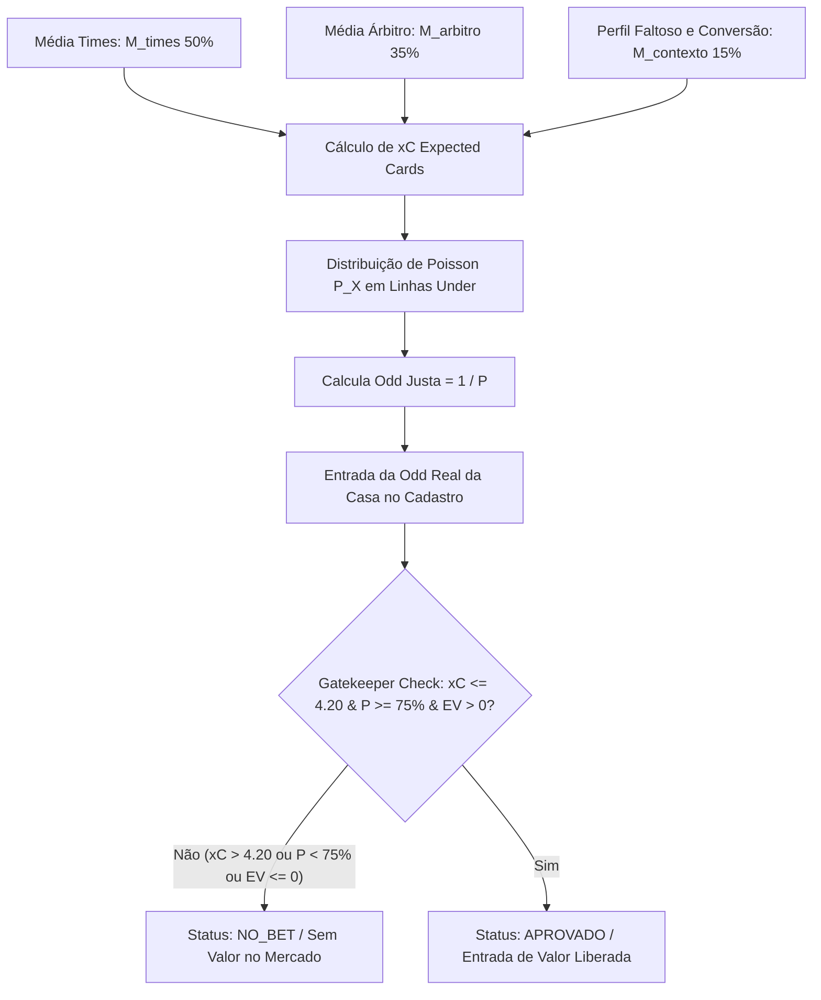

# Especificação Técnica: Sistema de Atribuição de Pesos e Predição de Cartões (Estratégia Exclusiva Under)

## 1. Contexto e Problema Identificado

### O Caso de Estudo: Sarmiento Junín vs. Independiente Rivadavia & Apostas em Linhas Altas
Em análises anteriores de partidas, observou-se uma contradição estatística e alto risco na geração de palpites de cartões:
- **Árbitro:** P. Echavarria (Moderado, média de 4.33 amarelos/jogo).
- **Faltas:** Perfil com alto volume de faltas.
- **Palpite Gerado Antigo:** Over 4.5 Cartões (com 68.07% de probabilidade).
- **Resultado Real:** O jogo teve baixíssimo volume de cartões (1 a 2 cartões), gerando RED nas apostas Over.

### Diagnóstico da Falha e Diretriz de Correção
1. **Risco Inerente de Entradas no Over:** Linhas de Over (ex: Over 3.5, Over 4.5) dependem de alta intensidade contínua do jogo e arbitragem rigorosa durante os 90 minutos. Qualquer oscilação gera Reds imediatos.
2. **Diretriz Absoluta:** O sistema **NUNCA mais recomendará apostas em Over de Cartões**.
3. **Obrigação Dupla Under:** O sistema deverá apresentar **pelo menos 2 opções de Under de cartões** (ex: `Under 5.5` e `Under 4.5`, ou `Under 6.5` e `Under 5.5`) validando a probabilidade de Poisson acumulada.
4. **Obrigação de NO_BET:** Caso o $xC$ seja elevado ou imprevisível (tornando linhas Under arriscadas), o sistema **deve obrigatoriamente emitir o sinal `NO_BET`** (Sem Aposta / Linha Desfavorável).

---

## 2. Arquitetura da Solução Estatística & Financeira

A arquitetura combina a **Expectativa Matemática Ponderada de Cartões ($xC$)**, a **Distribuição de Poisson**, a **Odd Justa ($\text{Odd}_{\text{Fair}}$)** e a **Leitura de Mercado (+EV)** com a **Trava de Segurança Exclusiva Under**.

---

## 3. Formulação Matemática

### 3.1. Expectativa Matemática de Cartões ($xC$)

$$xC = (w_{times} \times M_{times}) + (w_{arbitro} \times M_{arbitro}) + (w_{contexto} \times \Delta_{contexto})$$

Onde:
- **$M_{arbitro}$ (50% de peso direto):** Média histórica de cartões amarelos do árbitro na competição.
- **$\Delta_{contexto}$ (15% de peso de faltas):** Ajuste baseado na Taxa de Conversão $Cartões / Faltas$ e perfil do árbitro.
- **Total Árbitro (65%):** O perfil do árbitro modula 65% da expectativa final de cartões.
- **$M_{times}$ (35% de peso):** Média combinada de cartões (Média Mandante em casa + Média Visitante fora).

#### Tabela de Pesos do Sistema:
| Métrica | Identificador | Peso ($w$) | Papel no Algoritmo |
| :--- | :--- | :---: | :--- |
| **Média do Árbitro (Direta)** | `yellows_referee` | **0.50** | **Âncora Principal (50%):** O rigor do apito define o teto do jogo. |
| **Conversão Faltas/Cartões** | `foul_conversion_factor` | **0.15** | **Ajuste Contextual (15%):** Avalia a severidade real das faltas. |
| **Média Combinada dos Times** | `team_cards_combined` | **0.35** | **Fator Complementar (35%):** Histórico das equipes no confronto. |

---

### 3.2. Cálculo de Probabilidade Real via Distribuição de Poisson (Linhas Under)

Assumindo que eventos de cartões em uma partida de futebol seguem uma Distribuição de Poisson de parâmetro $\lambda = xC$:

A probabilidade acumulada de ocorrer **Under $N.5$** (até $N$ cartões) é:

$$P(X \le N) = \sum_{k=0}^{N} \frac{e^{-xC} \cdot xC^k}{k!}$$

As probabilidades para as linhas principais de Under são calculadas dinamicamente:
- $P(\text{Under 6.5}) = P(X \le 6)$
- $P(\text{Under 5.5}) = P(X \le 5)$
- $P(\text{Under 4.5}) = P(X \le 4)$
- $P(\text{Under 3.5}) = P(X \le 3)$

---

### 3.3. Cálculo da Odd Justa ($\text{Odd}_{\text{Fair}}$) e Valor Esperado ($EV$)

Para cada probabilidade $P = P(X \le N)$ em decimal ($0 \le P \le 1$):

$$\text{Odd}_{\text{Fair}} = \frac{1}{P}$$

No momento do cadastro da aposta no sistema (via preenchimento manual ou automação), o usuário/sistema informa a **Odd Real da Casa ($\text{Odd}_{\text{Casa}}$)**. O Valor Esperado ($EV$) é calculado por:

$$EV = (P \times \text{Odd}_{\text{Casa}}) - 1$$

- **$EV > 0$ ($\text{Odd}_{\text{Casa}} > \text{Odd}_{\text{Fair}}$):** Aposta com valor financeiro positivo (Aprovada pelo filtro financeiro).
- **$EV \le 0$ ($\text{Odd}_{\text{Casa}} \le \text{Odd}_{\text{Fair}}$):** Aposta sem valor no mercado (Sinalizado como `NO_BET`).

---

## 4. Regras de Segurança e Trava (Under Gatekeepers)

### 4.1. Regra de Sugestão Dupla Under
O sistema deve obrigatoriamente identificar **pelo menos 2 linhas de Under** com probabilidade de Poisson de alta confiança (ex: a principal com $\ge 75\%$ e a secundária com $\ge 60\%$).

Exemplo de saída recomendada:
- **Opção Principal:** Under 5.5 Cartões (Probabilidade: 86.37% | Odd Justa: 1.16)
- **Opção Secundária:** Under 4.5 Cartões (Probabilidade: 72.82% | Odd Justa: 1.37)

### 4.2. Trava do Gatekeeper no Cadastro (Triplo Filtro & Faixa de Linhas Betano Under 4.5+)
No cadastro/entrada da aposta no **footballweb**, a validação avalia os critérios de forma condicional:

| Filtro | Parâmetro | Validação |
| :--- | :--- | :--- |
| **1. Linha Mínima Absoluta** | $\text{Linha} \ge 4.5$ | Bloqueia qualquer aposta em cartões com linha inferior a 4.5 (ex: Under 3.5, 2.5). |
| **2. Exigência Condicional Under 4.5** | $xC \le 3.30 \text{ e } P \ge 75\%$ | Apostas na linha Under 4.5 exigem expectativa muito baixa ($xC \le 3.30$) e alta probabilidade Poisson ($P \ge 75\%$). |
| **3. Risco Estatístico ($xC$)** | $xC \le 6.50$ | Impede apostas Under em partidas com expectativa descontrolada de cartões ($xC > 6.50$). |
| **4. Mapeamento Dinâmico Betano** | $xC \le 3.30 \Rightarrow \text{Under 4.5}$ $3.30 < xC \le 4.20 \Rightarrow \text{Under 5.5}$ $4.20 < xC \le 5.80 \Rightarrow \text{Under 6.5}$ $5.80 < xC \le 6.50 \Rightarrow \text{Under 7.5}$ | Seleciona a linha de maior segurança oferecida na Betano de acordo com o risco do jogo. |
| **5. Probabilidade Mínima ($P$)** | $P(\text{Under Linha}) \ge 60\%$ | Garante margem estatística suficiente de acerto via Distribuição de Poisson (exige $\ge 75\%$ para Under 4.5). |
| **6. Exigência de Odd REAL Betano** | $\text{Odd}_{\text{Betano}} > 1.0$ (API-Sports #32) | Exige que a Betano possua o mercado de cartões realmente aberto à venda no momento da execução. Elimina odds sintéticas. |
| **7. Piso Mínimo de Odd (Risco/Retorno)** | $\text{Odd}_{\text{Betano}} \ge 1.50$ | Rejeita apostas com odd inferior a 1.50 (ex: 1.18) para evitar risco desproporcional por retornos baixos. |
| **8. Trava de Amostragem/Suspeição** | $\text{Média por Time} \le 1.00 \text{ ou } \text{Jogos} < 2$ | Desconfia de médias de cartões $\le 1.00$ por time ou amostra insuficiente, ativando trava de segurança `NO_BET`. |

- **Status `APROVADO`:** Todos os critérios são atendidos e a Betano oferece cotação $\ge 1.50$. Aposta liberada.
- **Status `NO_BET`:** Se qualquer um dos critérios falhar ou se o mercado da Betano não estiver disponível / odd $< 1.50$.
- **Documentação Detalhada de Automação:** Veja [`docs/footballweb/REGRAS_CRIACAO_APOSTAS_CARTOES_BETANO.md`](file:///root/datalake-air-flow-delta/docs/footballweb/REGRAS_CRIACAO_APOSTAS_CARTOES_BETANO.md).

---

## 5. Exemplo Numérico Aplicado (Sarmiento vs. Ind. Rivadavia)

Dados de Entrada:
- $M_{times} = 3.00$
- $M_{arbitro} = 4.33$
- $M_{contexto} = 3.30$

**1. Cálculo do $xC$:**
$$xC = (0.50 \times 3.00) + (0.35 \times 4.33) + (0.15 \times 3.30) = \mathbf{3.51 \text{ cartões}}$$

**2. Probabilidades Poisson e Odds Justas ($\lambda = 3.51$):**
- $P(\text{Under 6.5}) = \mathbf{93.61\%} \implies \text{Odd Justa} = \mathbf{1.07}$
- $P(\text{Under 5.5}) = \mathbf{86.37\%} \implies \text{Odd Justa} = \mathbf{1.16}$
- $P(\text{Under 4.5}) = \mathbf{72.82\%} \implies \text{Odd Justa} = \mathbf{1.37}$

**3. Validação do Gatekeeper no Cadastro:**
- **Cenário A (Odd da Casa = 1.71 para Under 5.5):**
  - $xC = 3.51 \le 4.20$ ✅
  - $P = 86.37\% \ge 75\%$ ✅
  - $EV = (0.8637 \times 1.71) - 1 = \mathbf{+47.69\%} > 0$ ($\text{Odd Real } 1.71 > \text{Odd Justa } 1.16$) ✅
  - **Status:** 🟢 `APROVADO` (Aposta de Alto Valor).

- **Cenário B (Odd da Casa cai para 1.10 para Under 5.5):**
  - $xC = 3.51 \le 4.20$ ✅
  - $P = 86.37\% \ge 75\%$ ✅
  - $EV = (0.8637 \times 1.10) - 1 = \mathbf{-4.99\%} \le 0$ ($\text{Odd Real } 1.10 < \text{Odd Justa } 1.16$) ❌
  - **Status:** 🔴 `NO_BET` (Sem valor financeiro no mercado).

---

## 6. Alterações no Código

### Arquivos Alvo:
1. `scripts/football_ingest_trends.py`:
   - Calcular e armazenar dinamicamente as probabilidades de Poisson e odds justas para todas as linhas de Under.
2. `src/footballweb/app/Database/Migrations/create_apostas_table.sql`:
   - Adicionar colunas `odd_justa`, `probabilidade_poisson`, `ev_percentual` e `status_gatekeeper`.
3. `src/footballweb/app/Controllers/ApostaController.php`:
   - Integrar o Gatekeeper de triplo filtro no método `store()`.
4. `src/footballweb/app/Views/apostas/index.php`:
   - Atualizar interface e badges para refletir a validação `APROVADO` vs `NO_BET`.

---

## 7. Hierarquia de Dados de Cartões e Trava de Segurança na DAG

### 7.1. Hierarquia de Fontes de Dados
Para evitar distorções estatísticas decorrentes de atribuição de médias genéricas/fictícias:
1. **Fonte Primária (Banco Local MySQL):** O sistema tenta calcular a média móvel de cartões por time a partir do histórico real de partidas encerradas (`status = 'FT'`) salvas em `fixtures_trends` ou `match_statistics_cache`.
2. **Fonte Secundária (API-Sports):** Se a equipe possuir menos de 3 partidas com estatísticas registradas no banco local, efetua a consulta das estatísticas passadas via API e persiste os cartões no MySQL.
3. **Fallback Obrigatório (`NO_BET`):** Se os dados de cartões da equipe não forem localizados nem no banco local nem na API, o sistema **NUNCA atribui médias estimadas ou fallbacks genéricos**. A partida é obrigatoriamente gravada com o sinal:
   `🚫 NO_BET: Dados de cartões indisponíveis ou insuficientes para análise estatística segura dos times.`

### 7.2. Trava da DAG de Apostas Automáticas
A DAG de criação automática de apostas (`criar_apostas_cartoes_diario.py`) inspeciona o `prediction_text` do confronto. Sempre que identificar o sinal `NO_BET` ou indicação de dados de cartões ausentes:
- Retorna `status_gatekeeper = 'NO_BET'`.
- Bloqueia compulsoriamente a criação da aposta para a partida, preservando a banca.

---
*Documento atualizado com as diretrizes de hierarquia de dados de cartões (DB -> API -> NO_BET) e trava da DAG.*
